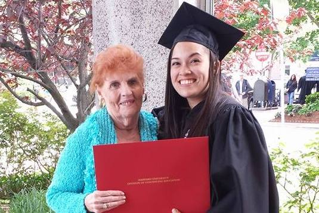
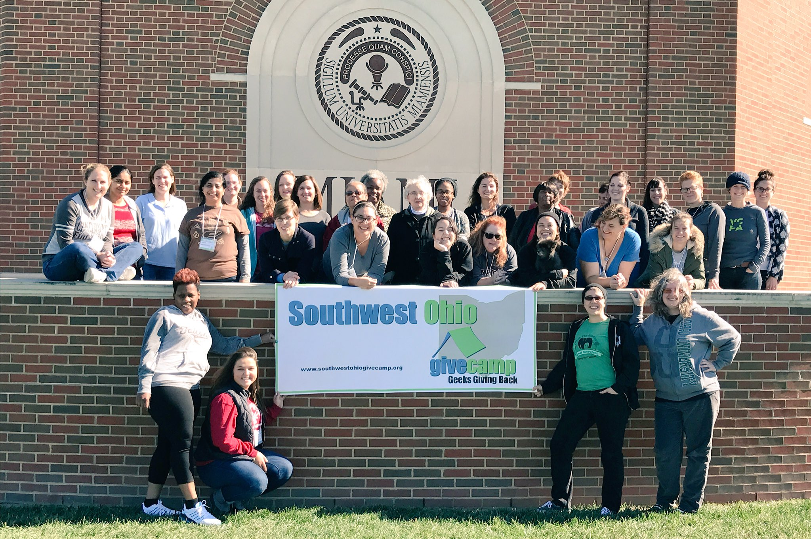
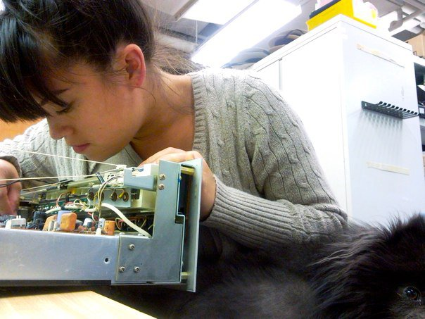

# Advocating for Developers & Kendo UI

### My Journey to Kendo UI
Unlike most people I know, I didn't start taking classes in CS because I hoped to work in the field one day; I took them because they sounded cool. The first class I took was 'Creative Explorations in Screen-Based and Physical Computing'. See? Sounds pretty cool. My mother was an electronics teacher at our local community college and would let me play with the breadboards while I waited for her to be done with work. I figured this class would let me play some more, and it definitely did. After that class I wanted to learn more about Java because I wanted to be able to do more. Eventually I was told I had enough credits for an Associates degree which then turned into a Bachelors concentrated in Computer Science. 

*A happy Nana and "smart cookie" granddaughter on graduation day*

In one of the classes I took, creating mobile application for Window's Phones (remember those?), I was introduced to Kendo UI. As an untraditional college student, working and going to school full-time, I was really excited & relieved at how quickly you could throw together an application (or assignment 😁).

Kendo UI has changed a lot since those day, although it is still easy to use and great for rapid development, it has become more adaptable and has a ton of new features.

### Becoming a Develop Advocate
After graduating I decided to follow a career in Node.js. I had always really liked working with Javascript, being able to work with the same language both client-side and server-side was a huge bonus to me. This allowed me to really drill down in Javascript, learning the fundamentals and core concepts to be able to understand the language even better.

I spent most of my career as a Software Engineer writing Node applications to handle administrative tasks behind the scenes and to help users work on their projects in teams at our sibling PAAS company [Modulus](http://modulus.io). I filled in when our support engineer stepped down and found the task rewarding. Although jumping in and out of servers and using Docker was very fun, it was helping other developers solve their problems that felt the most rewarding.

After switching back to the engineering team I dedicated my spare time to creating and aiding organizations that I felt really helped developers and my local tech community. I started the [Cincinnati branch of Women Who Code](https://twitter.com/cincywwcode) and joined my fellow developers, Jack Boberg & Matt Hernandez, to start the [Cincinnati Chapter of NodeSchool](https://github.com/nodeschool/cincinnati). In these two organizations I've been able to work with a lot of local developers to learn, teach and give back to our community.

*Cincy Women Who Code members working with other local developers to help non-profits at this year's Southwest Ohio Givecamp*

I may be bias because I am one, but I really like developers. I didn't realize before I started forming and being involved in these groups that a career existed that's main purpose is to advocate for developers. Thanks to Progress Software not only did I learn how important that position is to this company, I also had the opportunity to switch from Software Engineer to Developer Advocate.

### Kendo UI + Developer Advocate = 🙋🏻
Just last week I happily signed on as the new Developer Advocate for Kendo UI joining the very talented team including [Ed Charbenaeu](http://developer.telerik.com/author/echarbeneau/) and [Todd Motto](http://developer.telerik.com/author/tmotto/). It's really an awesome time to be joining the team because of all the hard work the Kendo UI's engineering team has put in to release some amazing advances. Recently the team released [Kendo UI for jQuery 2016.3.914](http://www.telerik.com/blogs/kendo-ui-for-jquery-r3-2016) which included feature improvements, bug fixes and new widgets. 

I am also extremely excited for the introduction of [Kendo UI for Angular 2](http://www.telerik.com/kendo-angular-ui/). With the much anticipated release of Angular 2 this adaption for Kendo UI comes at the perfect time. For those who are switching from Angular 1 check out this [great article](http://developer.telerik.com/featured/angular-2-upgrade-strategies-angular-1-x/) by Todd about upgrade strategies.

As one of the developer advocates I'm here to make your experience with Kendo UI the best we can make it. I want to know Kendo UI backwards and forwards so I know if there's a way to solve any hurdles you come to or if we need to work with our engineering team to create a solution.

In order to really know our product I'll be diving into the Kendo UI documentation and utilizing all of our tools to create a bunch of new projects. I've always believed that to really know how something works you have to build things with it, then break them and fix it all over again. I'm really great at the 'breaking it' part and am getting better and better and the fixing 😁. I'm really looking forward to showing you the things I build & working with you to help build and mend your projects!
 

### Check it Out!
Here are some of the resources I've been diving into as I start digging into Kendo UI. Always feel free to reach out to us with any questions too!

- [Getting Started](http://www.telerik.com/kendo-ui/getting-started)
- [Documentation](http://docs.telerik.com/kendo-ui/intro/installation/getting-started)
- [Demos](http://demos.telerik.com/kendo-ui/)
- [How do I](http://docs.telerik.com/kendo-ui/framework/class/inheritance)
- [Tutorials](http://docs.telerik.com/kendo-ui/framework/class/inheritance)
- [Blog Posts from Cool Kids](http://www.telerik.com/blogs) 🤓

### 🎶Come and Talk to Me🎶
I really want to meet you. Seriously, I would love to chat and see you at any events we both happen to be at. You can keep up with where I am on twitter [@tzmanics](http://www.twitter.com/tzmanics) & tweet at me anytime! Besides talking about my adventures with Kendo UI and all things tech I also am very excited to talk about hiking, [Toshi](https://www.instagram.com/explore/tags/toshmagosh/) (my blue pomeranian), making, learning, teaching, alternate universes & post-apocalyptic sci-fi. Hope to talk to you soon!

*Toshi helping me clean out the ol' Marantz*

