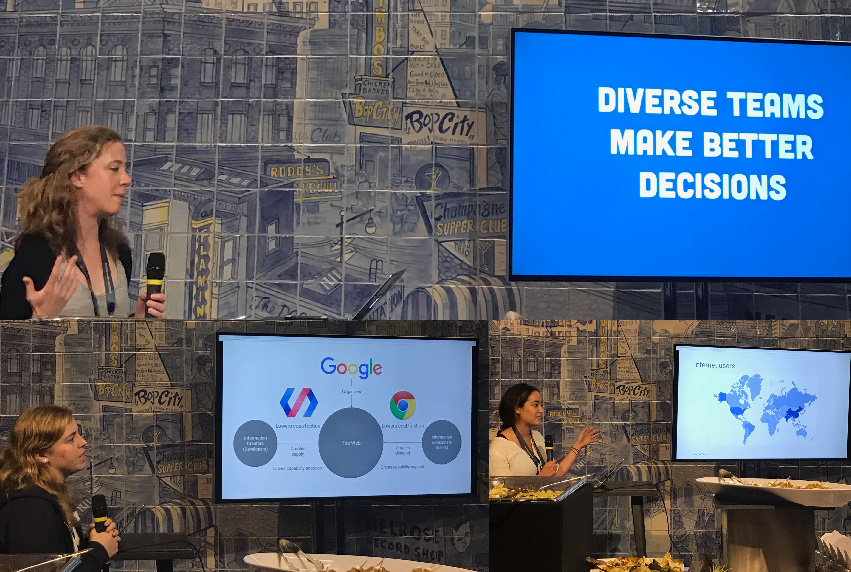
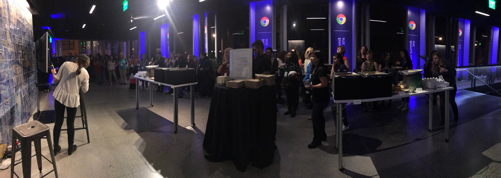
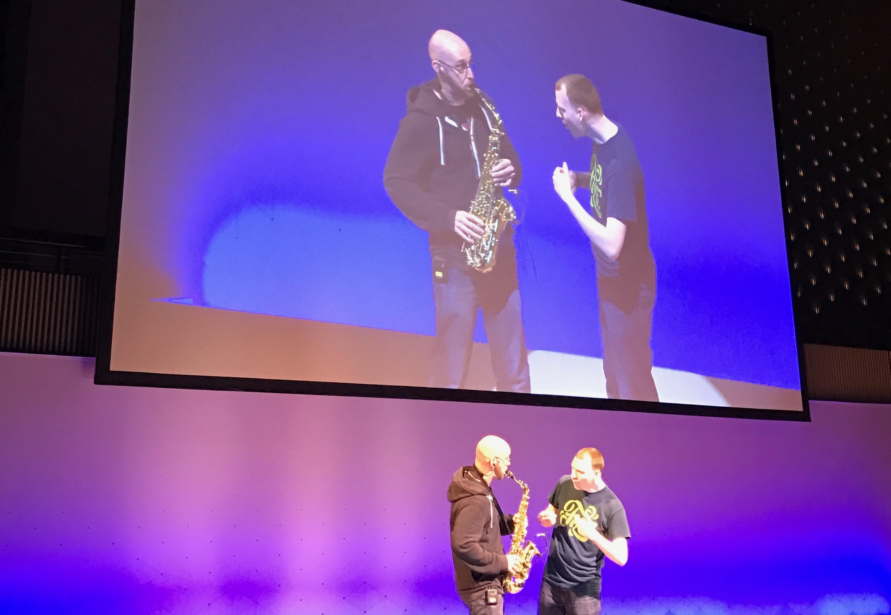
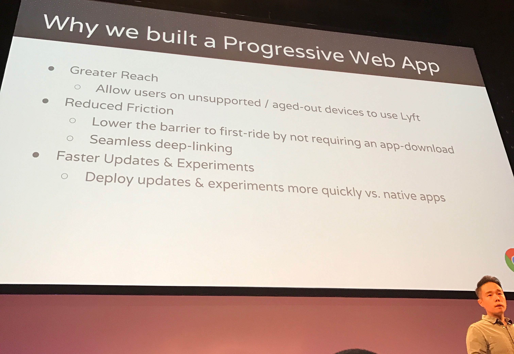
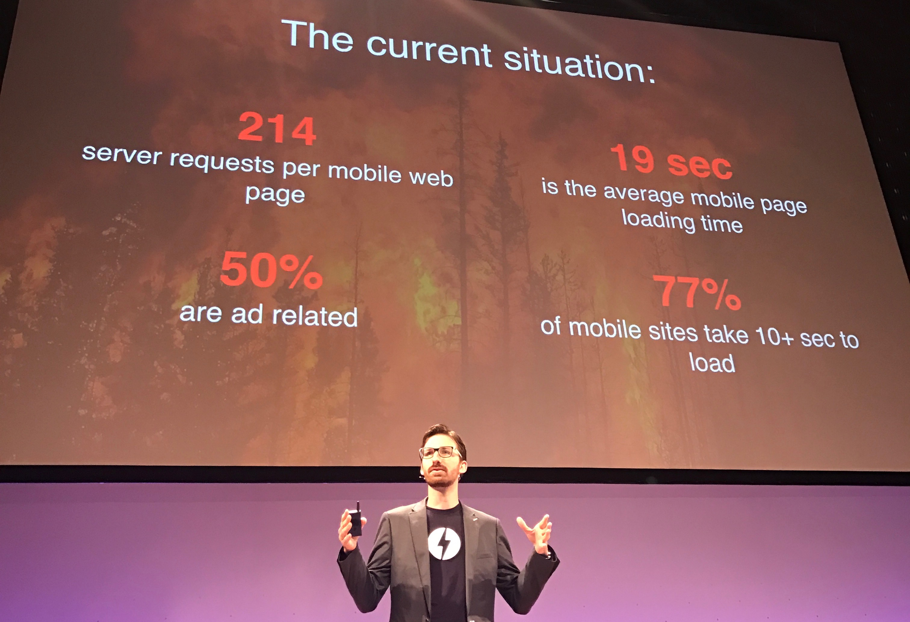
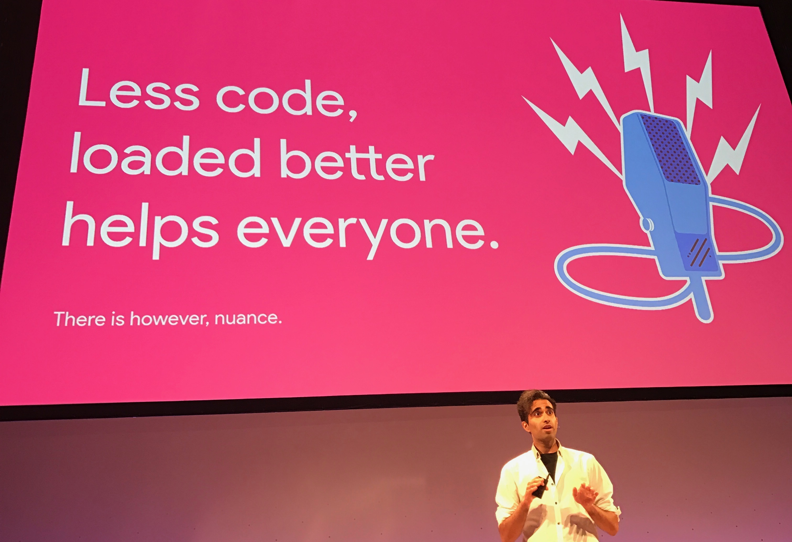
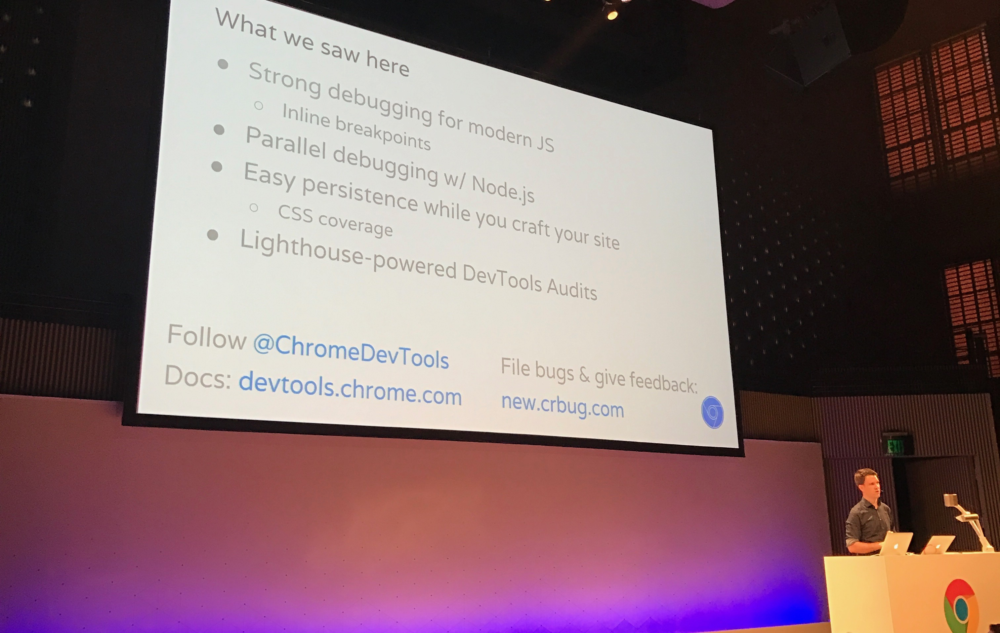
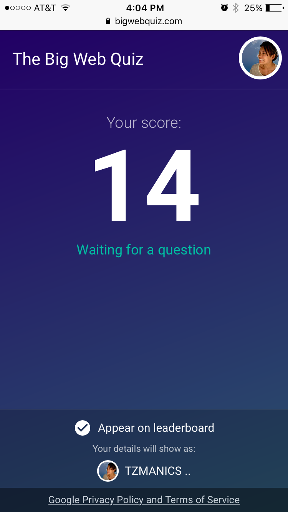

# My Experience at Chrome Dev Summit 2016

It's clear to see that Google is heavily invested in the future of the PWAs and AMPs because more users are relying on their phones to get them around the web and carry out their online tasks. We have yet to see the outcome beyond early adopters. However, we keep an eye out for more companies making moves to incorporate PWAs into their already existing systems. At this year's [Chrome Dev Summit](https://developer.chrome.com/devsummit/), I was fortunate to get a glimpse of Google's vision for the web. This post summarizes what I experienced and saw.

## Location, Location, Location

Unlike last year, this year's stage was in San Francisco's Jazz Center. This allowed for more coders and entrepreneurs in the area to attend. The turnout this year was awesome. Possible reasons? The event was free, it was very close to the mecca of SF and maybe there was a need for unity after such a divisive and tumultuous election season. Whatever the explanation, Google expected around 650 attendees and over 850 showed up. Fortunately, Google was able to host the overflow at one of their local offices.

*SFJAZZ at Franklin &amp; Fell Street*

## Women Techmakers Social Event

I was fortunate enough to kick off this year's Chrome Dev Summit by attending the [Women Techmakers'](https://www.womentechmakers.com/) event the night before. There were great talks by women from the Google team covering accessibility, diversity, as well as the directions their teams are moving in to advance usability on the web.

*Some of the great talks including ones from [Alice Boxahll](https://twitter.com/sundress) (top) &amp; [Wendy Ginsberg](https://twitter.com/wmginsberg) (lower left)*

After the talks I was able to chat with a lot of women from all over who were working in tech. It was great to be able to get and give different tips and ideas for projects, career decisions and community events all in one evening!

*A view of the captivated Women Techmakers crowd*

## 🎼 Off to a Jazzy Start 🎷

[Paul Lewis](https://twitter.com/aerotwist) &amp; [Jake Archibald](https://twitter.com/jaffathecake) kicked off the day with not only a good sketch and lovely accents but also an amazing saxophone solo.

*Paul Lewis showing off his talent on the reed.*

Then we started to dive in to the discussion of [Progressive Web Apps](https://developers.google.com/web/progressive-web-apps/) (PWAs). PWAs as well as Google's [Accelerated Mobile Pages Project](https://www.ampproject.org/) (AMP) were definitely the main focus of the event. It's hard to really explain exactly what a PWA is without delving in but it is basically a web application that uses technologies like offline caching, push notifications and home screen icons to make it feel like you're using an app. The best way I found to wrap my mind around it was to go through a tutorial like Pete LaPage's ['Your First Progressive Web App'](https://developers.google.com/web/fundamentals/getting-started/codelabs/your-first-pwapp/).

## Experiences Using PWAs
Representatives from Microsoft, Lyft and Housing.com came to the stage and described why they found PWAs to be beneficial to their company. Lyft has already implemented a PWA version of their application. It was a way for new user's of Lyft to not have to download the app to try out their first ride. This is great for the user because, as Google's [Thao Tran](https://www.linkedin.com/in/thaotran01) talked about, Lyft's download size went from iOS at 75MB or Android at 15MB down to >1MB using PWAs.

Lyft also took advantage of the online caching that PWAs provide by allowing user's to rate their drivers even if they were not connected. Then, once connected again, the information was sent. They took advantage of Google's Payment Request API including Android pay as one of the new payment options as well.

*Lyft's case for building Progressive Web Apps*

## Making A Case for AMPs

As many of the Google crew that presented touched on, in an ideal world online content should be "interactive in 5 seconds on a 3g network." Yet, as [Paul Bakaus](https://developer.chrome.com/devsummit/schedule/sessions/from-amp-to-pwa) stated in his talk, 77% of mobile sites take 10+ seconds load with an average of 19 seconds. Google's AMPs hope to clear that up my using optimizations in the javascript that is used, loading and rendering content, handling extension mechanisms and more ([check out the full explanation here](https://www.ampproject.org/learn/how-amp-works/)).

*🔥Scary facts slide🔥*

## Nuances &amp; NASA data

[Addy Osmani]() came to the stage and discussed another hot topic of the event: PRPL pattern (pronounced 'purple' as in ['purple rain'](https://www.youtube.com/watch?v=yZLJRGPhBck))
- __Push__ critical resources for the initial URL route.
- __Render__ initial route.
- __Pre-cache__ remaining routes.
- __Lazy-load__ and create remaining routes on demand.

This is a pattern used with PWAs that focuses on enhancing performance with app delivery and launch. You can look into it more [here](https://developers.google.com/web/fundamentals/performance/prpl-pattern/). The nuances Addy discusses are based on how loading your app may require more scripts or have different parse and eval times.

*Addy trying to help everyone!*

I unabashedly ❤️ space big time, so I was very excited to see that Addy worked with a team to create a PWAs to better share NASA's amazing amount of open source data. You can check out the application on this PWA: https://code.nasa.gov/ and look at the NASA project repo [here](https://github.com/nasa/code-nasa-gov).

## DevTools improvements

The most interesting segment for me was Paul Irish's talk on the advancements in the Chrome DevTools. Adding the ability to debug Node files in the console feels like a great shortcut to an abundance of log files. You can now also type more naturally in the console window with smart line breaks and dig further into objects with new depths in dot notation. All of this teamed with the live diff of the changes you make while in Dev Tools will add for quick turn arounds with bugs. [Here](https://medium.com/@paul_irish/debugging-node-js-nightlies-with-chrome-devtools-7c4a1b95ae27#.t01olpwtj) is his blog post discussing debugging Node.js files.

*Lots of applause from the crowd for the DevTools advancements!*

## ‼️ The Big Web Quiz ‼️

I would be remiss if I didn't mention the most fun part of the conference...'The Big Web Quiz'! There may have been a bit of stall to the jump off due to the amount of connections hitting their app but that was soon resolved & we all joyfully competed against one another.

*If only I could add a sound bite of the super intense quiz music*

# Wrap it Up

I came away from this year's Chrome Dev Summit with a much clearer picture of what Google envisions for the future of the web. This future is aligned closely with PWAs and AMPs due to their obvious benefits in traditionally challenging app scenarios. I was excited by what I saw and I'd encourage you to judge for yourself by [watching the videos of the recorded sessions](https://www.youtube.com/playlist?list=PLNYkxOF6rcIBTs2KPy1E6tIYaWoFcG3uj). All in all, I had a great time and I hope to attend next year!
