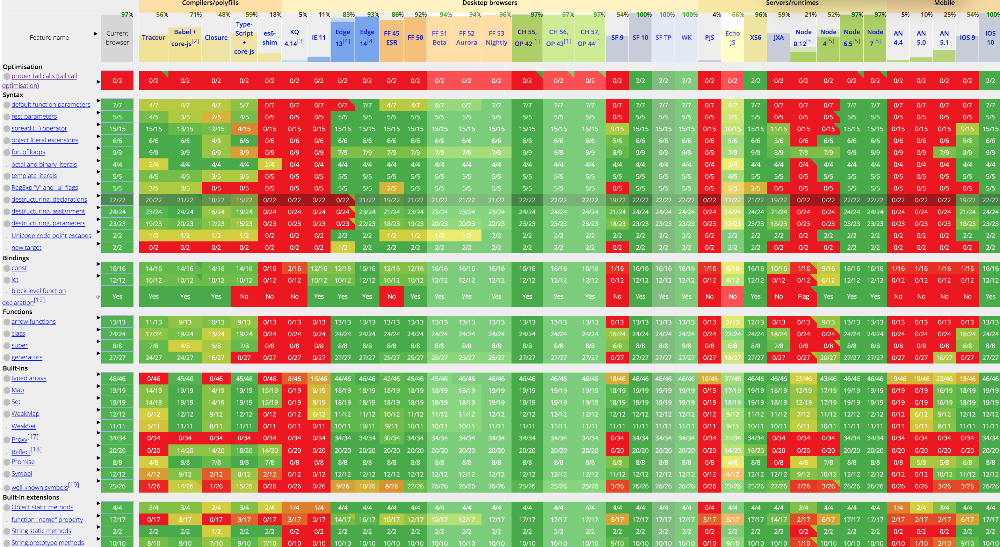
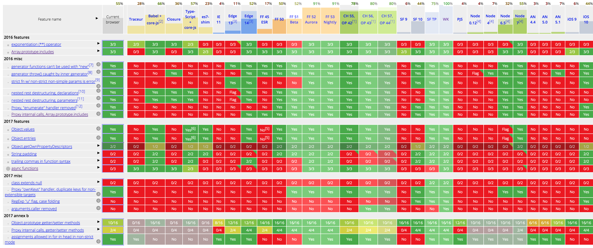
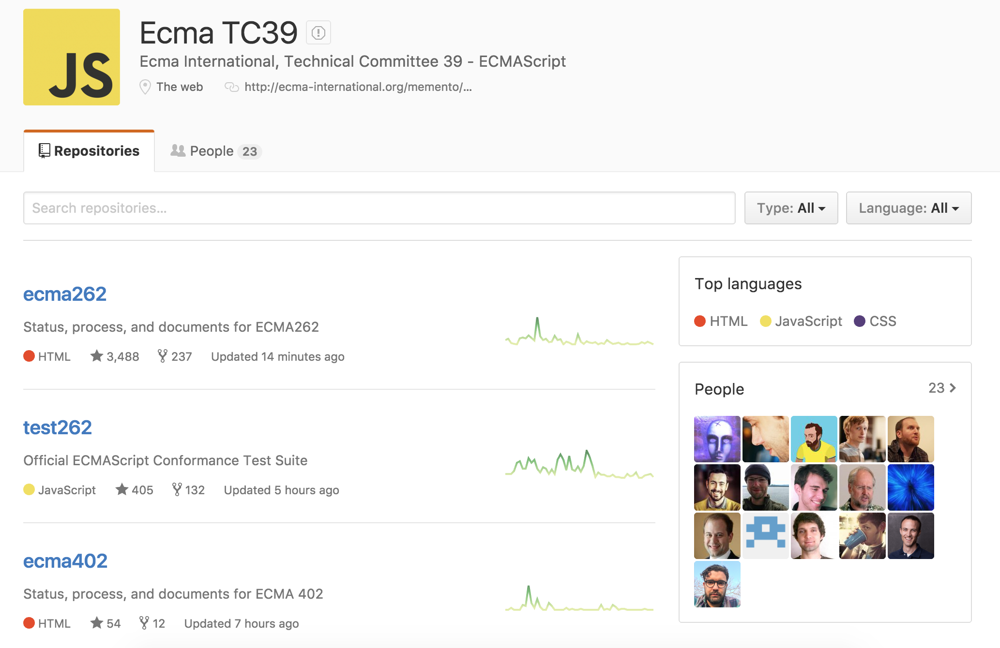
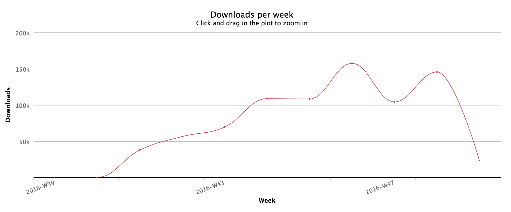
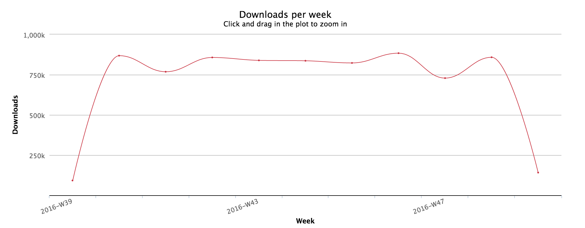
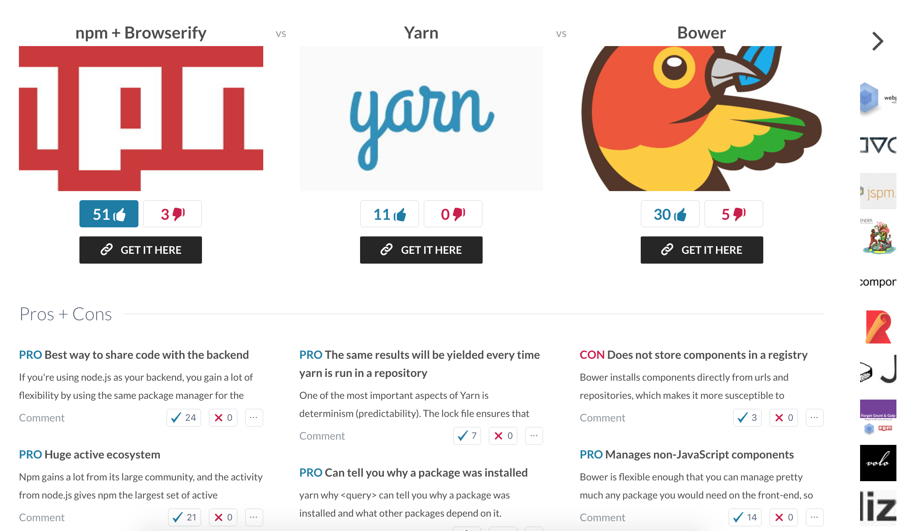
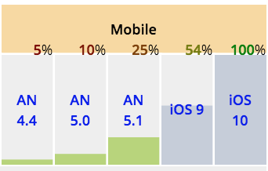

# JavaScript’s Journey through 2016

Every year there seems to be more and more ways to use JavaScript and 2016 turned out to be no different. Dependent on your level of optimism this can be extremely exciting or extremely [confusing](https://hackernoon.com/how-it-feels-to-learn-javascript-in-2016-d3a717dd577f#.enx29pov9). Last year we made some predictions about JavaScript in 2016. Now, I'll look back to to see if our predictions held true or went the way of the political pundits. Then I'll use what we've learned this year to make an educated guess on what we'll get out of 2017.

*This comic doesn’t do anything new.*

## ES2015 Browser Implementation

As of June 2016 we moved from the 6th edition of ECMAScript, [ES2015](http://www.ecma-international.org/ecma-262/6.0/) (once referred to as ES6), to the 7th edition, [ES2016](http://www.ecma-international.org/ecma-262/7.0/). If only they had made one less edition, these numbers would have matched up so nicely 😉. I have a feeling we’re all smart enough to figure it out though. The next edition we’ll move to is [ES2017](https://tc39.github.io/ecma262/) but that may not be until June 2017 (if not later). Sometimes, like in the chart below, the upcoming features of ES2016 and ES2017 are just lumped into the ES2016+ category. Since we'll be referencing this chart a lot, I'll use ES2016+ to describe the future features as well. ES2015 contained a lot of features that developers felt would make programming in JavaScript better, like arrow functions, promises, destructuring and more. Here we’ll look into how the features of ES2015 were handled in 2016 and if they held up to our expectations.

In order to use features from ES2015 that weren’t supported by browsers, servers or runtimes [source-to-source transpilers](https://scotch.io/tutorials/javascript-transpilers-what-they-are-why-we-need-them0) like [Babel](https://babeljs.io/) and [Traceur](https://github.com/google/traceur-compiler) are used so developers can write with the ES syntax then have it compiled into compatible JavaScript. Thanks to the ever-handy [ECMAScript compatibility table](http://kangax.github.io/compat-table/es6/) from [kangax](https://github.com/kangax), we can see a lot of green, meaning a lot of features are supported in many browsers.

*ES2015 Compatibility chart from [kangax](https://gratipay.com/~kangax/)*

Currently, Firefox 50 is supporting 92% of the ES2015 features, Chrome 55+ and Node 6.5+ are at 97%, while Safari 10 and iOS 10 are at 100%! The only feature holding back the 97%-ers is the optimisation feature of ES2015, [`proper tail calls`](http://www.ecma-international.org/ecma-262/6.0/#sec-tail-position-calls). This is great news for developers who want to use these features without transpilers.

Although there are some features of ES2016+ already being supported (Firefox 52+ is already at 91%) there is still a lot of red.

*ES2016+ Compatibility chart from [kangax](https://gratipay.com/~kangax/)*

So far though, this feature list is shorter than ES2015 and the only "large feature" is `async functions` (which is already supported on Firefox 52+ and Chrome 55+). With the success of the browser support for ES2015 it looks very likely that we will again get close to 100% compatibility with the main browsers for the ES2016+ features.

## Modules, the Most Important Addition?

Last year we proclaimed that ES6 modules would be the most important addition and that still seems to be ringing true. As predicted, a lot of developers have taken advantage of the ES6 module syntax in their code thanks to transpilers like Babel or Traceur. It’s hard to gather numbers to back this up but if you read all the articles on the "top" or "favorite" new features from ES2015, modules is almost always listed.

We were hoping for a native module system in 2016 so that commonJS, AMD, UMD, and non-native loaders like browserify, webpack and systemJS were no longer necessary. So far, it looks like we're going to have to keep waiting because tackling the loading process for modules is proving to be quite a feat. There does seem to be a lot interest and work going into this feature though. There is [a great recap](https://hackernoon.com/node-js-tc-39-and-modules-a1118aecf95e#.6ufrm94fb) from James Snell about a [TC-39](https://github.com/tc39) meeting he attended to get info on the feature
> "There is a proposal being put before TC-39 that would introduce a new `import()` function.
>
>The import() function...is processed at evaluation. It also imports an ESM (or CommonJS module) but, like the require() method in Node.js currently, operates completely during evaluation. Unlike require(), however, import() returns a Promise, allowing (but not requiring) the loading of the underlying module to be performed fully asynchronously.”

This would also allow us to make calls like `await import('foo')`. To be clear, this may still be a long way off but it is currently [in stage 3](https://github.com/tc39/proposal-dynamic-import)! Here’s a breakdown of their process to explain what ‘stage 3’ actually means: [TC-39 Process](https://tc39.github.io/process-document/). Based on the amount of interest in this feature, I have faith that it will get released in 2017.

*The brave ECMA TC-39 https://github.com/tc39*

## Popular Features of 2016

Following ES6 modules, we predicted that the other stand-out feature of the year would be Promises. No one likes [callback hell](http://callbackhell.com/) or [the pyramid of doom](http://photos3.meetupstatic.com/photos/event/4/b/c/2/600_436939394.jpeg), so native promises was a very welcomed feature. Developers have covered Promises a lot in posts and tutorials, likely because they seem complex when you begin to use them.

*The only kind of callback people seem to appreciate these days*

A few other ES6 features that got a lot of attention were [spread parameters](https://developer.mozilla.org/en-US/docs/Web/JavaScript/Reference/Operators/Spread_operator), [destructuring](https://developer.mozilla.org/en-US/docs/Web/JavaScript/Reference/Operators/Destructuring_assignment) and [default parameters](https://developer.mozilla.org/en-US/docs/Web/JavaScript/Reference/Functions/Default_parameters). A lot of developers (including myself) found these features to be helpful in making their existing JavaScript code more powerful, concise and/or readable.

A few of the new features are also touted to [fix the "bad parts" of JavaScript](https://medium.freecodecamp.com/5-javascript-bad-parts-that-are-fixed-in-es6-c7c45d44fd81#.asjj30yo6).
- To add block scope and prevent variable hoisting outside of the scope you can now use [`let`](https://developer.mozilla.org/en-US/docs/Web/JavaScript/Reference/Statements/let) and [`const`](https://developer.mozilla.org/en-US/docs/Web/JavaScript/Reference/Statements/const).
- With [arrow functions](http://exploringjs.com/es6/ch_arrow-functions.html) the variable "this" always points to the object that it is physically located within.

*simply put*

- The [rest parameters](https://developer.mozilla.org/en-US/docs/Web/JavaScript/Reference/Functions/rest_parameters) feature lets us treat the parameters like an array so that we can use the array functions like slice, sort, etc.

As developers get used to the new syntax changes and the benefits they yield, I think we will see more openness to adding new features. I'm seeing more and more tutorials pop up incorporating the ES2015 syntax without mention or explanation of ES2015. This makes me believe that it is becoming the new normal and that this trend will continue into 2017.

## Classes: Objects and Prototypes

There were many discussions and strongly-held views about the inclusion of ES2015 Classes. Thankfully, people have made their points and the debate has seemed to die down.

As predicted, people stay steadfast in their preference to Object-Oriented Programming, Functional Programming, etc. The biggest point made about [ES6 Classes](https://scotch.io/tutorials/better-javascript-with-es6-pt-ii-a-deep-dive-into-classes) was to specify that they were mostly syntactical sugar for prototypes and not to be confused with traditional classes like those from Java.

I do not think that 2017 will be the year that all developers decide that they will all work together and only write functional JavaScript. I have worked on group projects and just getting 5 people to agree on semicolon usage is difficult enough. React had built a class system for their framework but are very open to the [inclusion of ES2015 classes](https://facebook.github.io/react/blog/2015/01/27/react-v0.13.0-beta-1.html) as is [Angular 2](http://learnangular2.com/es6/classes/). With frameworks making the use of classes easily accessible it will be up to teams and developers to choose to be classy or classless in their code.

## Additional Features
Last year we decided the proposals likely to be added to the language were Exponential Operator, Array.protoype.inlcludes, SIMD.JS - SIMD APIs + polyfill and Async Functions. Let's see how far we've come with each of these Additional Features.

[__Array.prototype.includes__](https://github.com/tc39/Array.prototype.includes) - this feature is still considered a ES2016 feature and is actually supported on Edge 14, Firefox 45+, Chrome 55+, Safari 10, Node 6.5+ and iOS 10.

[__SIMD__](https://github.com/tc39/Array.prototype.includes) - is listed as a "Candidate" at stage 3 but will be a large feature.

[__Async Functions__](https://tc39.github.io/ecmascript-asyncawait/) - are the only "large" feature on the list for ES2017 features and are already supported by Firefox 52+ and chrome 55+.

## Package Managers

Going into 2016 we suggested using [systemJS](https://github.com/systemjs/systemjs) and [jspm.io](http://jspm.io/). This is still a solid option. Just in 2016 systemjs has been downloaded over [4.4 million](https://npm-stat.com/charts.html?package=systemjs&from=2016-01-01&to=2016-12-06) times, [~520,000 in the past month](https://www.npmjs.com/package/systemjs).

*systemJS weekly npm downloads from January 2016 to December from https://npm-stat.com/*

jspm is coming in at [~2.2 million](https://npm-stat.com/charts.html?package=jspm&from=2016-01-01&to=2016-12-06) for the year and [~200,000 for the month](https://www.npmjs.com/package/jspm).

*jspm’s weekly npm downloads from January 2016 to December from https://npm-stat.com/*

It seemed that people were leaning towards making npm the go-to package manager for both front and back-end. This still seems to be the case, especially with npm being paired with webpack and browserify.

The npm registry is still at the top, after all it provides access to over [300,000 packages](https://www.youtube.com/watch?v=5ikjwX2ur2U) and there are more than [4 million people](http://www.modulecounts.com/) using the registry. There is an advantage to using the same package manager if you are using Node.js as your backend.

Looking back on last year's predictions, we did not take into account the option of a new package manager coming onto the scene. Yet, that's exactly what happened when Facebook introduced yarn in October.

Facebook had been using npm but once their codebase and engineering team grew they started running into problems and decided to create their own package manager. [yarn](https://yarnpkg.com/) gained a lot of interest right when it came out thanks to the big names involoved: Google & Facebook. Based on the npm download stats, yarn took a dip while the US was on Thanksgiving break and hasn’t surpassed it’s ~160,000 download mark from November. We’ll have to keep an eye on yarn but so far its November downloads (~538,000) aren’t even coming close to npm’s (~3.6 million).

*yarn’s weekly npm downloads from October to December from https://npm-stat.com/*

*npm’s weekly npm downloads from October to December from https://npm-stat.com/*

To be clear, yarn is not a replacement for npm. It is a CLI client that fetches the modules *from* the npm registry. I would immediately assume that we would not see another package manager in 2017 but Facebook may have opened the field up for more contenders. Even with snafus like the [left-pad](http://developer.telerik.com/featured/left-pad-indicative-fragile-javascript-ecosystem/) situation, npm feels very reliable.

Slant.co created [a survey](https://www.slant.co/topics/1488/~front-end-package-managers) for their users to be able to rate and explain the pros and cons of different front-end package managers.

*A snippet of the Slant survey results*

So far the top 3 products are npm + Browserify with a total of 51 upvotes and 3 downvotes, Bower with 30 upvotes and 5 downvotes and JSPM with 15 upvotes and 2 downvotes. There are only 169 votes, this is a small pool of developers but it is still interesting feedback and should grow more over time.

# Issues Resolved in 2016
We touched on a few key issues that we believed needed to be resolved in 2016, here's the update on each of those.

- "How native modules are loaded in a browser will need to be ironed out and an initial implementation will need to commence."

As we touched on a bit before, this is still a work in progress. The good news is that this is something the technical committee is working on. The implementation has not happened but it seems that it is on track for 2017.

- "We haven't fully scratched the async itch. While, await functions will help, the journey is far from complete. Promises and eventually streams will need to be used throughout (e.g. HTTP promises). And O'yeah, canceling a promise. That might be a good idea."

Promises are supported on all major browsers and async functions are set to be a 2017 feature.

- "Concurrency and parallelism (i.e. parallel processing) in JavaScript will need to be addressed and webworkers will have to step up or step aside."

The TC39 are considering multithreading but it is hard to say when that will start making its way through the pipeline. There is a [proposal for parallelism with web workers](http://www.infoworld.com/article/3138963/javascript/javascript-insiders-predict-its-future-features.html), running scripts in background threads. It is a very complicated issue to work through but it would increase performance using multicore processors.

- "The should we or shouldn't we debate about immutable native objects will hopefully conclude."

I'm not hearing much on this conversation presently but it seems to boil down to what programming paradigm you subscribe to. If you are truly using functional programming you never attempt to mutate state. Therefore, it should not matter if the state is technically mutable. If you are using object-oriented programming, immutability is an odd fit because immutability is technically about data-structures. That being said, there are ways to make it work, if you're up for it. Here is [a thorough article](https://sidburn.github.io/blog/2016/03/14/immutability-and-pure-functions) discussing just that.
- "Lastly, payoff whomever it takes for all browser manufacturers to treat the JavaScript runtimes in a mobile browser with the same status as a regular browser.""

Unfortunately, looking back at the ECMA Compatibility Table, it seems no one has been paid off. iOS has 100% compatibility but Android seems to be falling behind at mere 25% for Android 5.1. With Google's recent push for [Progressive Web Apps](https://developers.google.com/web/progressive-web-apps/) and focus on cell phone and tablet usage, I believe all mobile browsers will have to catch up fast. Maybe then, the only ones getting a payoff will be us, the users!

*The results for ES2015 compatibility on mobile.*

## Options Overload

At the beginning of 2016 we were already aware that the many different styles for constructing JavaScript applications were overwhelming. We had hoped that we would be able to update the way we think about and teach JavaScript development to accommodate the variations. I do believe that the focus on best practices is present. Unfortunately, there are still so many ways to build JavaScript applications that it is hard to find multiple tutorials or examples that have the same application setup.

Although many developers seems to be suffering from JavaScript fatigue, I believe they are actually suffering from the [paradox of choice](https://www.ted.com/talks/barry_schwartz_on_the_paradox_of_choice). In my local JavaScript communities there is always a lot of conversations about the pros and cons of using different JavaScript technologies and the best ways to implement new features. How do you commit when things are changing so fast? New tools are popping up just as fast as old ones are dying. You can spend hours researching how to create your new JavaScript application. Then, after the onslaught of options, you end up paralyzed with indecision and instead decide you would be happier searching for [Chevrotains](http://www.toonts.com/chevrotain/) in the rainforests of West Africa—which feels much more stable because they haven't changed for over 5 million years.

*How could you not want to search for these amazing creatures?!*

The good news is that we, as a community, are becoming more aware of this problem. I do not think that we will all decide to use the same style for how we build our JavaScript applications but, hopefully, we will slow the creation of new options. This is a very optimistic prediction but I think in 2017 we'll be able to start streamlining our approaches to building applications.

# Usage

Last year we mentioned WebAssembly stealing some of the spotlight from JavaScript once it hit all the browsers. It hasn't taken over the internet yet but there have been great advancements for WebAssembly this year. V8 has a [WebAssembly Browser Preview](http://v8project.blogspot.com/2016/10/webassembly-browser-preview.html) and the [WebAssembly Community Group](https://www.w3.org/community/webassembly/) has their MVP and JavaScript API implemented on several browsers. They are planning for the Browser Preview to finish in Q1 2017, so we'll see what comes next very soon! If you want to get a taste, you can [check out the demo](http://webassembly.org/demo/) using Chrome Canary and Firefox Nightly (you will have to switch some flags).

*It looks like a great year for WebAssembly*

We did predict that JavaScript would become the language of native applications (NativeScript, Electron, React Native) because developers would want to write in JavaScript alone. According to the [State of JS](http://stateofjs.com/2016/mobile/) survey results from [Sacha Greif](https://twitter.com/SachaGreif) show that developers may be easing their way into JavaScript mobile frameworks. As for desktop applications, Electron has reached over 1.6 million downloads and React Native close behind with 1.5 million since their releases in 2014 (over 200k and 180k in the last month, respectively). With this increase in downloads and NativeScript's plans to also include desktop support, Javascript is definitely infiltrating the native application scene and will continue to do so into 2017.

Nothing seems to be hindering the continued growth of JavaScript usage and with it being a language you can use for practically everything (mobile, IoT, native, back-end, front-end) more developers may be switching over to JavaScript. The only slight downfall I see is that the onboarding process for new users may be quite overwhelming. With new features coming out from ES2015 and ES2016+, just writing JavaScript has many options. Once users decide on that, they then need to make a decision on frameworks, transpilers, package managers, modules and more. Nonetheless, I think all the powerful ways you can use JavaScript outweigh this issue. So, I would like to give a warm welcome to all the new JavaScript users, class of 2017 (or 2016+)!

# Conclusion
There are still a lot of exciting features that are going to be worked on and added in 2017. Our predictions from last year turned out to be pretty close but the hopes for better mobile browser and native module support will have to wait a little while longer. We’ll check back next year to see if there are new package management tools, if we’re over JavaScript fatigue and if everyone is referring to ECMAScript editions correctly. Until then, I think that we’ll all be able to make great projects with JavaScript and continue to learn a lot while doing so. Happy 2017, everyone!
