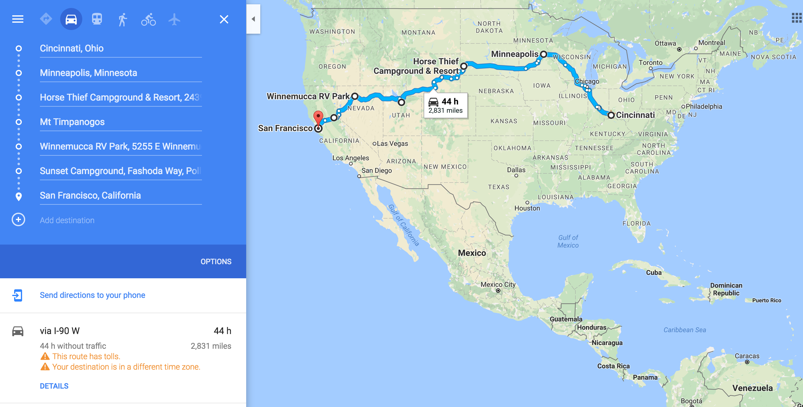
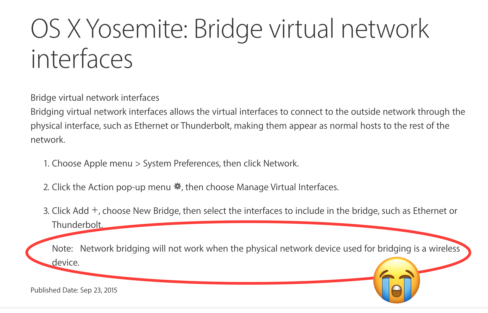

# Kendo Camper Tour
## Part 1: Setting up a Philips Hue to WIFI networks + 2,831 miles

I decided to go on a user group tour up the West Coast from San Francisco to Seattle. I believe that coding communities are very important, especially when you have the opportunity to be with your community in-person 🤝. I've been co-running a NodeSchool and Women Who Code group in Cincinnati and was excited to hang out and work with other communities in California, Oregon and Washington. To learn more about the what I've deemed the Kendo Camper Tour, you can check out [the tour page](http://www.telerik.com/campaigns/kendo-ui/tour) or find us on Twitter with the [#KendoCamperTour](https://twitter.com/search?q=kendocampertour&src=typd) tag. Feel free to [reach out to me](mailto:tmanicsi@progress.com) too if you want to schedule a talk!

*Just #toshmagosh and I hittin' the road*

I chose to work on a project specific to the Kendo Camper Tour, an application that let me control lights that I could hook up wherever I traveled. Then with each group I presented at I would discuss the step I was currently working on in that project. Since I was already presenting the breakdown of the project this way it seemed natural to put it down in blog post form as well. Voila 💁🏻 here is part 1.

*A "coding campsite" in Provo, Utah, Mt. Timpanogos.*

### The Plan
This project would require me to setup the IoT lighting devices, create an Angular PWA, connect to the IoT device's API and build Kendo UI components to let the user interact with the IoT devices. I wanted to learn more about PWAs and IoT lighting so this project seemed like a perfect approach to my camper lighting needs. I made a breakdown of each step I would have to take to conquer this project.

1. Make sure the IoT actually works
2. Create Angular app
3. Add the UI components
4. Integrate IoT API to the Angular app UI
5. Upgrade to a PWA

I decided to take on the first part of this project while traveling the 2,831 miles to my first speaking spot in San Francisco, CA. To get the most out of the drive from Ohio we went from Minnesota to South Dakota to Utah to Nevada and finally to California.

### The IoT
I went with the [Philips Hue](http://www2.meethue.com/en-us/) system, at first because of their [Hue Go](http://www2.meethue.com/en-us/productdetail/philips-hue-go) wireless light would be perfect for the camper. We don't have many outlets inside the camper and it's nice to have the lights outside. Plus, look at how this woman looks at that light 😍💡! Don't you want a light that you love this much?!

*I mean do YOU look at YOUR lights like this??*

I then looked into the [Philips Hue API]() and was very impressed. Not only do they have a [Developer's Program]() that helps you get started and offers a lot of resource but their API documentation was on point! 😍 What I mean by that is that it was easy to navigate, thoroughly documented with clear instructions on how to make a request and what the response should look like. The only little annoyance was having to login each time I needed to reference the API, not a a big deterent tho.

I spoke with someone while on the Kendo Camper Tour and they said they had worked with the Philips Hue API a few years ago and it was _not_ easy! So, 👏👏👏 to Philips Hue for putting in the effort to fix it and make your product easy to code!

Before commiting to using Philips Hue I also had to make sure this nomad setup would work with their hardware. Normally, you would plug the Philips Hue bridge directly into your WiFi router. As you now know, my situation was not normal. Instead I needed to bridge a WiFi connection to the ethernet connection of the Hue Bridge. I found a Mac Thunderbolt to Ethernet adapter and thought, "I got this 😎"!"

Wrong 😖

- First, I will need to connect to a WIFI router. Once the computer is connected to WIFI you can plug an ethernet cable in and bridge those two connections so that the WiFi connection is fed to the ethernet. What's happening inside the computer may be way more complicated than I'm making it out to be, but let's keep things simple for now. Stay tuned for an in-depth look into what happens when you bridge an ethernet cable to your WiFi connection. Just kidding! Hope I didn't get anyone's hopes up 😘

- Once I knew this was a possibility I ran to the nearest Best Buy (in American Fork, UT) and bought a Thunderbolt to Ethernet adapter. Lo and behold 🌩 you can NOT bridge on a Mac if the device you're trying to bridge to is wireless.

- Thankfully, my husband is not a Mac person AND his fancy computer (Lenovo W530 ✨) still has an ethernet port 😲. In the car, driving through the mountains I was able to plug the Hue bridge in to a power outlet, connect its ethernet to the laptop, connect to my our mobile hotspot and bridge the connections to give the Hue Bridge access to the internet. 💫 TADA 💫

- Couldn't actually get an IP from the bridge when using the movile hotspot.

- Our next camper home was in an RV park that had WIFI.
I connected to the WiFI and bridged the connection between the WiFi connection and the ethernet port. Three blue lights == first success!

- Connected and was able to control the lights.
Once I got the

- I decided to try it at my next speaking venue, DNA Pizza.

- Now that I knew I could take the Hue Bridge connection my next step was to create the Angular application and the light's UI components.

- Keep your ear to the Telerik Developer Network ground for Kendo Camper Tour Part 2: Creating an Angular Application with Kendo UI Hue Controls + WaffleJS
