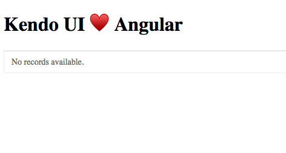
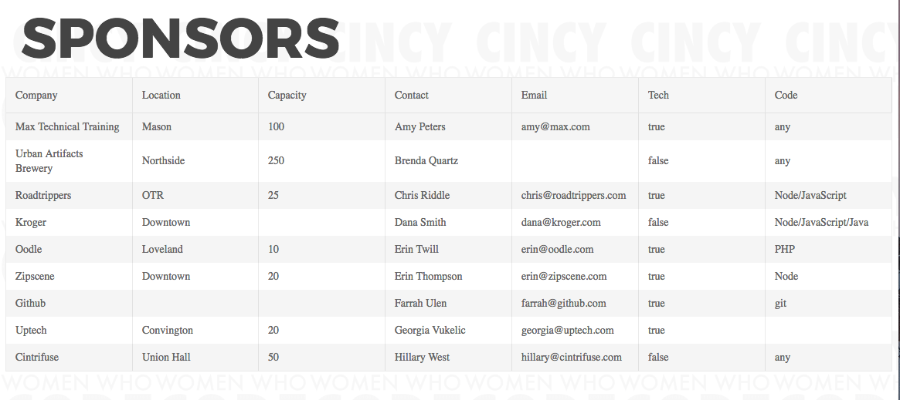

# How to Build an Angular App
## with a Kendo UI Grid

In my last blog article on building an angular app we created a web app using
the angular CLI and added Kendo UI's default styling. In this post we'll look
into how to add a grid component. We're going to need to have
[`npm`](https://www.npmjs.com/) and [`node`](https://nodejs.org/en/download/)
installed. It is best to have the LTS version of Node and latest version of
npm.

### Project Setup

To get started we'll clone our base Angular project that has our Kendo UI
default styling already in place.

```bash
git clone https://github.com/tzmanics/KendoUI-Angular
```

This will give us a working Angular application that already has the
Kendo UI default styling. You can also just create a new angular project with
no styling. If you have the Angular CLI installed you will just need to run `ng
new <project-name>`. 

From your project's directory run `npm i` to install all of the dependencies.

> If you get an `npm ERR!` make sure you're logged in to the Progress registry
in order to install our modules. Check out the info
[here](http://www.telerik.com/kendo-angular-ui/getting-started/#toc-add-the-progress-npm-registry).

Today we'll be doing all our work in the `src/app` folder. At this point that
directory should look like this:
```bash
- src
  - app
      app.component.html
      app.component.scss
      app.component.spec.ts
      app.component.ts
      app.module.ts
```

Now to make sure everything is working let's run `ng serve` in our terminal
and open up a browser window to `http://localhost:4200/` to see the application
is running. If your screen says 'Kendo UI ♥️ Angular', you are golden & ready to go!

#### Project Repo
You can look at all the source code for this project in its
repo [here](https://github.com/tzmanics/angular-app-grid). I've also listed a
link to the commits that show all of the code changes for each section. Just
look for the  and you'll find the link to the
code changes :)

### Adding the Grid Component
#### Installing and Importing
To add the grid component we first need to install it and its dependencies 👍
```bash
npm install --save @progress/kendo-angular-grid @progress/kendo-data-query @progress/kendo-angular-intl @progress/kendo-angular-l10n
```

Once downloaded, we'll edit our main module file to import the grid module.

`src/app/app.module.ts`
```ts
import { BrowserModule } from '@angular/platform-browser';
import { NgModule } from '@angular/core';
import { FormsModule } from '@angular/forms';
import { HttpModule } from '@angular/http';
import { GridModule ) from '@progress/kendo-angular-grid'; // 👈 import the module

import { AppComponent } from './app.component';
import { SponsorGridComponent } from './sponsor-grid/sponsor-grid.component';

@NgModule({
  declarations: [
    AppComponent,
    SponsorGridComponent
  ],
  imports: [
    BrowserModule,
    FormsModule,
    HttpModule,
    GridModule // 👈 use it in your AppModule
  ],
  providers: [],
  bootstrap: [AppComponent]
 })
export class AppModule { }
```
 [Commit for Installing and Importing](https://github.com/tzmanics/angular-app-grid/commit/609abe425ba678c3ce0f6f78990683602e5819d3)

#### Adding the Grid Component and Initial Code
We're going to give the grid its own component. The angular CLI makes that very
easy; we just have to run:
```bash
ng g component sponsor-grid
```
I've been needing a grid to list out all the sponsor information for my local
Cincy Women Who Code branch, so the component is named `sponsor-grid`. Feel
free to name it whatever floats your ⛵️..

The angular CLI creates a separate folder for the new component. This is what
the file structure looks like now:
```bash
- src
  - app
      app.component.html
      app.component.scss
      app.component.spec.ts
      app.component.ts
      app.module.ts
      - sponsor-grid
          sponsor-grid.component.html
          sponsor-grid.component.scss
          sponsor-grid.component.spec.ts
          sponsor-grid.component.ts
```
It also does us the kind favor of implementing it in our main module file. Check it the changes.
`app/src/app.moddule.ts`
```ts
...
import { AppComponent } from './app.component';
import { SponsorGridComponent } from './sponsor-grid/sponsor-grid.component'; // 👈

@NgModule({
  declarations: [
    AppComponent,
    SponsorGridComponent // 👈
  ],
...
```
The `sponsor-grid.component.ts` file already has assigned the components
selector (`app-sponsor-grid`), so let's open up the main components HTML page
and add the selector.
`src/app/app.component.ts`
```html
<h1>
  {{ title }}
</h1>
<app-sponsor-grid></app-sponsor-grid>
```
With all of that in place we can now add the Kendo UI grid to our `sponsor-grid`
component's HTML. We'll just assign `data` property right now and bind it to
actual data in the next step. 
`src/app/sponsor-grid/sponsor-grid.component.html`
```HTML
<kendo-grid [data]="sponsorGridData">
</kendo-grid>
```
If we still have `ng serve` running or run it again. We can take a look at the
app (`http://localhost:4200`) and see that everything is running smoothly but
we have `No records available`.



This makes sense because we haven't added any data yet. Guess what's next!


 [Commit for Adding Grid Component and Initial Coder](https://github.com/tzmanics/angular-app-grid/commit/4003cc9cc5fcba421391342ed1bc84195fb64392)

### Working with the Grid
#### Adding Data as an Array Object
Let's take a look at what we get right out of the box without any fancy data
binding or messing with any of the parameters. All we'll need to do is assign
an array of objects to the `sponsorGridData` that we fed to the `data` property
in the `sponsor-grid.component.html` file. We'll do this in that components
main TypeScript file.

`src/app/sponsor-grid.component.ts`
```ts
import { Component, OnInit } from '@angular/core';

@Component({
  selector: 'app-sponsor-grid',
  templateUrl: './sponsor-grid.component.html',
  styleUrls: ['./sponsor-grid.component.scss']
})
export class SponsorGridComponent implements OnInit {
  sponsorGridData = [{
    Company: 'Max Technical Training',
    Location: 'Mason',
    Capacity: 100,
    Contact: 'Amy Peters',
    Email: 'amy@max.com',
    Tech: true,
    Code: 'any'
  },{
    Company: 'Urban Artifacts Brewery',
    Location: 'Northside',
    Capacity: 250,
    Contact: 'Brenda Quartz',
    Tech: false,
    Code: 'any'
  },{
... // check out the source code for the full list
  }];

  constructor() { }

  ngOnInit() {
  }
}
```
Before we take a look, I also added a new title and some styling to the
non-grid parts, so we have something nice to look at. If you're interested feel
free to copy and paste the code adding your own images and flare.
 [Commit for Fun Styling](https://github.com/tzmanics/angular-app-grid/commit/a2747f64a8c7daa3da20ce931fb0a205ad4cbfe5)

Now that we're all clear on that, let's see what we've got.


Without even telling the grid what goes where or doing anything special to our
data we have a legit grid! I know I work for the company but I was honestly
impressed when I first threw some data together and got this in return.


*MFW*

I intentionally made some objects without all the parameters. Although we don't
usually want to do this, especially if we have a data model, it is cool to see
that the grid component is like, "that's alright, I'll just keep going." The
grid is also responsive by default, fitting to the screen width.

Let's keep going and see what we can do to make this grid even more functional
and fancy.

 [Commit for Adding Data as an Array Object](https://github.com/tzmanics/angular-app-grid/commit/57c10534e0e1b74ed29fb9207f61c3cd521a4fb5)

#### Paging the Grid
#### Sorting the Grid
#### Closing Time


This is barely just skimming the surface of everything the Kendo UI grid
compnent can do. I highly suggest checking out the
[API](http://www.telerik.com/kendo-angular-ui/components/grid/api/GridComponent/)
and [documentation](http://www.telerik.com/kendo-angular-ui/components/grid/).
If you have anything that you are hoping to use the grid for and would like a
walkthrough like this on it, *please* feel free to comment below.  That's what
I'm here for!  You can also reach us on Twitter:
[@KendoUI](http://twitter.com/kendoui). Have a great time with your grid! 

Thanks for coding with me! ✌️
