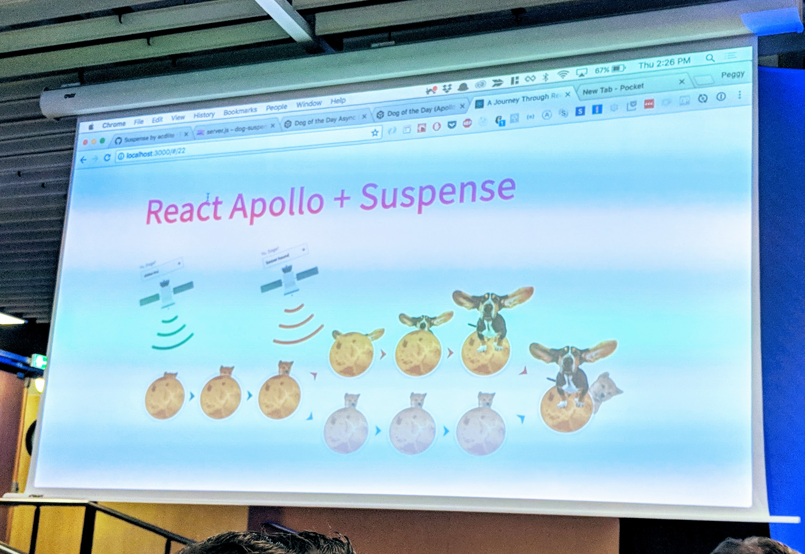

# Gif Guide: React Europe
Hello from [React Europe](https://www.react-europe.org) in Paris, France. Not only was this my first time in France but also my first React-focused conference! I knew this was going to be a fantastic conference when hearing that two of my favorite people were Keynoting and emceeing: [Ken Wheeler](https://twitter.com/ken_wheeler) and [Gerard Sans](https://twitter.com/gerardsans). As soon as the conference started there were already pastries and cafe galore.  The crowd was excited and friendly and my co-workers, [Carl Bergenhem](https://twitter.com/carlbergenhem) and [John Willoughby](https://twitter.com/_johnonline), were happily regaling the crowd with the news of our V1 Kendo UI for React [release](https://twitter.com/carlbergenhem) that happened the day before! Woo hoo!

For your viewing pleasure I present you with a quick recap of Day 1 at React Europe. Enjoy!

## Keynote - State of React: Ken Wheeler
To kick things off we had [Ken Wheeler](https://twitter.com/ken_wheeler)'s version of State of React aka The New Hotness in React. First he talked about the goings on with the start of React 16: Fiber was announced but what of it. Then he got into some of the new stuff with React 16.3 like new Life Cycles with async architecture that bring you more code safety. Next he walked us through Context which is Ken's "favorite feature in the whole entire world" and now it's fully supported. To showcase Context, Ken carbo-loaded us with a lovely demo.

Next he talked about Suspense, which we've been super excited about but have been waiting for in suspense 🥁. Ken reminded us that a couple days ago Andrew committed changes to master. So, it may be available in a few days. Such excite! He ran us through a very American demo plus a great one with the pics of his contributors called, "People I've Let Down" 😂.

## The Case for Whimsy: Joshua Comeau
First [Josh](https://twitter.com/JoshWComeau) we looked back at some fun 90's sites. Remember Ask Jeeves? I do, Joshua! The McDonald's 90's website had a little animation of a guy ducking out of the way after shining the arches. Josh hasn't yet "made a way to create cat gifs with React" but that may be his talk for next year. It's on record now, so it has to come true! He showed us a sandbox he makes when he builds out animation projects like the confetti he built for Kahn Academy.

Then he walked us through how he builds this canvas test atmosphere in React. After such confetti fun, Josh showed us how he made email more whimsical with etch-a-sketch-esque deleting email content and sending an email by having it fold-up like a letter 😍. He then showed us more animations and walked us through action-driven animation and state-driven animation. It was great to see such awesome UX that you could build with React and, as Joshua hilariously called it, your grandma's CSS.

Josh had a great point towards accessibility at the end,

>"If nothing else, we should make sure that our whimsical touches aren't harmful for folks with vestibular disorders."

He reminded us about `prefers-reduced-motion`, it isn't supported everywhere but Khan Academy has a setting you can set in the meantime!

## Subtyping is Overrated: Caleb Meredith
I was immediately excitedd about [Caleb](https://twitter.com/calebmer/status/997060779659747329)'s talk because one of the first slides had a baby doggy on the slide ❤!

This slide was actually making a distinction between JS and OCaml having animals on the JS side and plants on the OCaml side. Using this he delved into a conversation about classification. When it came down to it he was classifying JS and more as languages with subtyping and OCaml and others with no _implicit_ subtyping. He then went into explaining the ups and downs of subtyping. For instance, it is popular because subtyping is a big part of object-oriented programming but it also adds overhead. There were lots of shout outs to Reason because he knew his crowd 😉. He suggested the crowd replace 'Reason' with 'Ocaml' throughout his talk. One of Caleb's main points was that, "you can retain abstraction without subtyping."

## Declarative Future of Gestures and Animations in React Native: Krzystof Magiera
This talk jumped off with [Kryzstof](https://twittter.com/kzzzf) going way back with one of the first animations from 1878 of a horse running photographed by Eadweard Muybridge.

Then he discussed modern animations and how they are handled on the JavaScript thread. React Native has an animated API to help with performance of animations. Kryztof proceeded to walk us through key point of the API and the code for implementing animations. Talking us through the JS responder system he gave us more insight to what's happening behind the scenes between the UI and JS thread. Tying it all together Krysztof demoed the animation of gestures and announced the official release [`react-native-gesture-handler`](https://github.com/kmagiera/react-native-gesture-handler). Finally, he announced his new library [`react-native-reanimated`](https://github.com/kmagiera/react-native-reanimated) that you can check out today!

## LUNCH: 🥖 French Buffet 😋
Okay, so this wasn't a talk but THERE WAS SO MUCH FOOD! I figured this deserved a section and some visual proof.

## On Apollo: Peggy Rayzis
Little did we know but besides being an open source developer at Apollo, [Peggy](https://twitter.com/peggyrayzis/status/997096528119414784)'s also a time traveling astronaut. So, she took us time traveling through the story of Apollo starting from 2016. She told us about Apollo and how it helps you interact with your data using React. She continued by demystify the intelligent normalized cache 😅 phew. Time traveling to 2018 she reminded us of the React Apollo 2.1 release that had a new component API with render props.

In Apollo's future we discuss Suspense! Most importantly, Peggy's demo retrieved random pictures of 😍🐶DOGS😍🐶! An aptly named pausing demo (get it 'paws'ing). Next she had another demo showing off the Apollo cache in which she searched different dog breeds to show beautiful, lovely, adorable dogs. She interrupted her own search request with another request to show synchronous loading with interruptions by delaying rendering based on prioritization.

I had to add this last image because who doesn't love a puppy visualization?!

## Replicated Redux: Jim Purbrick
This talk focused on "simple shared reactVR experiences. [Jim](https://twitter.com/jimpurbrick) started with the origin story of the way they decided to build the ReactVR experience. He went through some code examples in redux to exemplify where it would lend itself to networking redux actions. Jim walked us through the code they created to mediate interactions and deal with conflicts between two users doing something at the same time.

Launching on Monday, they now have a Hasboro Toggle game that you can play with multiple players!

Jim showed a lot more code showing how the game handled actions in stores and how they generated lists of actions. One note he wanted everyone to keep in mind is to "please write property-based tests to save yourself" lots and lots of time. Needless to say, they put a lot thought of and powerful code into their ReactVR experiences to make them feel natural. He wrapped things up musing about what the future will bring for VR like choosing places to go in the city with friends through VR, what the role of avatars will be, how we will handle interactions like handshakes and more.

## Bridging React Native Back to its Roots: Vincent Riemer
We started by walking through [Vincent](https://twitter.com/vincentriemer)'s journey to speaking and the projects he would talk about which lead him to React Native. Through this journey we got to see many of the projects he built along the way.

After Reactive Native, Vincent naturally progressed to React Native Web. He did have a disclaimer to let us know that the following inormation was based on his gut feelings experienced while using React Native Web. He then tried to picture React Native on the web as being "web first." After running through a bunch of interesting experiments and projects he introduced [React Native DOM](https://github.com/vincentriemer/react-native-dom). It turns out his presentation was actually written in it. So we had been seeing a demo the whole time 😯! He showed just how easy it is to work through debugging your applications with a very dramatic/funny demo.

Another app he prepared was an awesome camera QR code scanning app that was able to scan his conference badge. He closed out his talk with a reminder to not actually use his project (at least not yet) and to come work on it with him!

## Do the Right (to Left) Things - Directional Content in React: Maja Wichrowska
[Maja](https://twitter.com/majapw) began with a love story that ends quite quickly because airbnb did not support arabic text. Do not fret, her talk was based on fixing this so that the love story could have a happy ending! First she discussed the many reasons why one should support right to left text beyond that it's the right thing to do (because it is!). One thing that stood in the way was understand how to also support bi-directional content including styling, icons and images. Maja talked about a library her co-worker made [`react-with-direction`](https://github.com/airbnb/react-with-direction) which is a great tool but they needed something more now. The room had a reaction, hard to tell who was for and who was against, when Maja announced that their current solution was CSS-in-JS 😲. She then talked us through the pros, cons and requirements for their implementation.

Here are the links for the code they used (including the awesome Kent C. Dodds RTL library: [react-with-styles](https://github.com/airbnb/react-with-styles) & [rtl-css-js](https://github.com/kentcdodds/rtl-css-js). They haven't launched their solution yet but are going to do so soon!

## The Fun of Runtime Type Systems: Michel Weststrate
Michel started this talk with a great story aligning Napoleon's failures with type assumptions.

He pointed out where lack of code or programmer assumptions with types could lead you into a losing battle of your own. Michel reminded us that type checkers can help you out of the coding trenches. Next, he delved into real-time types and soldiered on with a few demos.

After going over more types like direct, literal, union, and more, Michel charged into higher order types. He covered their downsides but gave us other strategies and options. In closing he quoted Napoleon one last time:

>"The amateurs discuss tactics; the professionals discuss logistics."

## Up and Running with Universal Components: Kurtis Kemple & Samantha Bretous
[Kurt](https://twitter.com/kurtiskemple) and  [Samantha](https://twitter.com/samanthahabretous) started by explainging to us "what makes a Universal Component." They touched on how it needs to be reusable across platforms, have a well-designed API, and must be available to all apps. They then discussed the complications in making a universal component to cover why not _every_ component needs to be a universal component.

After scaring us away from universal components (just kidding 😁) they covered the benefits to pull us back in. Kurt convinced Samantha to use universal components at this point, which is pretty lucky since the next part of their talk was Samantha teaching us how to get started. They ran through each step including everyone's favorite: making documentation. They wanted to stress an important point for us to make sure of:

>"Everybody is on board and they know what you are doing. It's not just a technical decision."

Their suggestion was to make an example to show stakeholders, product people and designers how you would be using and benefitting from universal components. Finally, the pair helped run us through how to set up developing in isolation. Then they ran through a demo of [storybook.js](https://github.com/storybooks/storybook) which can be used on any platform. Before closing out with demo they discussed optimization and version control.

## It's Lightning talk time!
There were some really great lightning talks covering everything from declarative data fetching to web performance. Instead of me listing all of them here, go to the [React Europe](https://www.react-europe.org/#schedule) to check them all out for yourself 👍.

## End of Day 1
What a great day in Paris for React lovers 💖. The first day of the conference wrapped with dinner, drinks and lots of socializing. Don't get too sad though, there is still one more day of React Europe to come! Check back here for another Gif Guide to tell you all about it!

## Did you say V1 of Kendo UI for React?
Why yes I did, you are so astute 😘! As, my awesome co-worker, Carl, says, "We are sticklers for a great product." SO, yes, we have had [React-specific components](https://www.telerik.com/kendo-react-ui) since January of this year but we wanted to make sure we had a stellar library to release for our V1. We're doing a live webinar at [ProgressNext](https://www.progress.com/next), on May 30th & 31st. Check that out or catch it on our [Youtube](https://www.youtube.com/channel/UCG-debAKyINSMrWnFz0w84A) channel if you miss the live show :).
