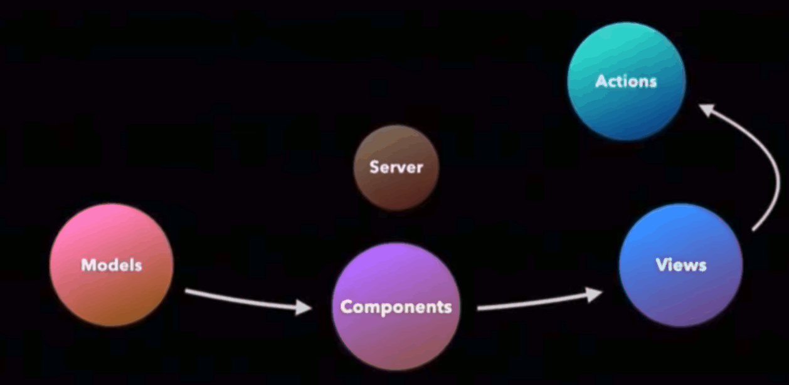

# Gif Guide: React Europe Day 2
It's another sunny day in Paris and day two of the React Europe conference. Just like the first day we started by socializing in the big hall, drinking tea, coffee, and juice while chomping on some croissants. Gerard Sans got us geared up for a second day of exciting announcements from great speakers and we jumped right in.

## ReasonReact and local state: Cristiano Calcagno
First up we had an intro to Reason from [Cristiano](https://twitter.com/ccrisccris). After the intro he lead us through Reason React. Reason React basically wraps React so that Reason can use it. He then showed us the simplest component you could make. It did look attainable, but simple wouldn't have been the word I would have chosen 😉.

Next, it was time to jump into state! Cristiano covered global state with some demos, then went deeper into discussing local state. He had some interesting ways to display images making them "as local and composable as possible."

Cristiano then took us into his research of animation in state with springs and local state.

## Full Stack Navigation: Eric Vicenti
[Eric](https://twitter.com/ericvicenti) jumped right into React Navigation by building out an application with us. Going over the Switch Navigator, Navigation Actions, Tab Navigator, and more.

After checking out the demo in a simulator, Eric started talking about URL routing. He repeated this three times to really make sure it sunk in:

>"URLs are navigation actions and not navigation state."

Got it? Good 👍.

Moving back to Navigators after understanding more about routers we jumped into more code. Lastly, Eric was very excited to tell us about Community Navigators, many navigators working well together. He demoed some "sassy login" that he imported from npm.

He ended his talk with a demo of a shared element navigation library [FluidTransitions](https://github.com/fram-x/FluidTransitions).

## A Year of CodeSandbox: Ives van Hoorne
Starting from the beginning, which is a good place to start, [Ives](https://twitter.com/CompuIves) told of us his CodeSandbox journey. He told us great stories of how he built up CodeSandbox and started to get recognition. Unfortunately, the better CodeSandbox did, the worse his exam scores got 😓. The funny thing about that is that people were using CodeSandbox to _learn_.

Ives, took this opportunity to show us how beginners are using CodeSandbox to learn React. He demoed many different tools you can use and different ways you can use to discover new things about React. He announced that the collaborative coding experience on CodeSandbox is now free for everyone to use 👏👏👏

## Moar Lightning Talk!
There were even more great lightning talks on the second day. I as really looking forward to [Kasia Jaztrzebska](https://twitter.com/kejt_bw)'s Hamlet rendition of 'To refactor or not to refactor' 😆. Check all of the sessions out here on [React Europe](https://www.react-europe.org/#schedule)'s website.

## The IDEA Architecture: Lee Byron
Before jumping into the thick of things [Lee](https://twitter.com/leeb) walked through what architecture is when it comes to software. He drew the line of the architecture metaphor between actual architecture concepts and how to build great apps. From here he discussed how we handle changes in our apps the complexity that comes from changes. Lee's solution was, what he calls, IDEA.

>"Immutable, Declarative, Executable Architecture"

He walked us through what this architecture was and why it was beneficial in building apps. Covering GraphQL he showed us a demo of how his team used colocated data dependencies.

Lee went on to discuss more structures and his creation, Immutable.js. He finished his loop by adding a queue and calling out to all devs to try their hand at creating a new queue library. Closing out his talk, Lee left us with one last bit of sage advice:

>"There is no Architectural Nirvana," instead we have, "exploration and improvement."

## Beyond React: Devin Abbott
"Should I use React Native" is the question that [Davin](https://twitter.com/dvnabbott) gets asked everyday and the question that started his talk. He went into the different ways that you could bring React into your applications on different platforms. The ideal situation he tried to tackle is bringing the benefits of React without a framework. In a demo he showed how he could add properties to a React Native component that would create equivalents in Swift.

Devin then went through the different ideas and conventions we need to follow to really make "write once code everywhere" a reality. Then he introduced us all to [Lona](https://github.com/airbnb/Lona) an OSS project he's been working on which enables you to build components visually. Devin showed us a preview of the Lona editor to help designers and coders build out components together.

## <title /> : Sunil Pai
[Sunil](https://twitter.com/threepointone) came out to drop his new CSS-in_js library!! Siiiiike 😆. He talked about his great history throughout React to reiterate his love for opensource.

It turned out his talk was about his journey through the web filled with awesome anecdotes and hilarious observations. Tbth, I cannot really write anything that would give this talk justice, you just have to watch it. Which is what I did: shut my laptop and watched.

## Using Lit APIs to Make Dope Games with Expo: Evan Bacon
[Evan](https://twitter.com/Baconbrix) started by explaining his twitter handle @BaconBrix, and it was a great explanation.

He immediately demoed his game to show us what games made with Expo looked like. It was great 🤘. Evan showed us some libraries you can use for making games on the web and some game examples he built. Beyond the game, Evan looked into all the screens that were being used in comparison to how many of those were actual game screens. He covered all the pieces he was able to easily implement with React native.

Looking into augmented reality in Expo, Evan talked about what is available and a PR he's hoping to push through soon to make more available. Next, he covered some information on Scenekit. In the end he covered more graphic centered tools and concepts as well as VR and AR.

## SVGR or How a Simple Problem Became a 2k Stars Library: Greg Berge
After introducing himself and his projects [Greg](https://twitter.com/neoziro) jumped into the problem his open source library hoped to tackle. He wanted his icons from sketch inside his React project, put simply, SVG to React. Instead of acting like a robot converting all his icons, he made a transformer.

Greg explained all the challenges that he ran into and how he went about solving them. Once he solved each problem he ran into he added features like Prettier, SVGO and H2X built-in plugins. Greg then showed us a demo of [SVGR](https://github.com/smooth-code/svgr), a discussion of how he marketed his project 🦁, and his "sexy" README. To finish his talk he announced that SVGR will be a part of the next release of `create-react-app`.

## Type-safe React Native with ReasonML: Jared Forsyth
[Jared](https://twitter.com/jaredforsyth) immediately let us know that his true goal of the talk was to get all of us to try out Reason. Not a bad goal 😉.

His talk focused on why it's interesting to have Reason and React together, how we could try it for ourselves, some surprising key differences from JavaScript, and the future of Reason + React Native. Jared had an interesting analogy of JavaScript as a ship whose hull had some cracks and holes that needed patched with tools like TypeScript or ESLint. Yet OCaml's ship didn't look as fun but had no need for patched.

## It's the End of the Day as We Know it & I Feel Great!
To end the conference there was a Q&A panel featuring all the speakers. Before saying goodbye for this year, there was a little social to grab a drink and say bye to React Europe friends.

## That's a Wrap 🎬
These two days of React Europe went by in a fun and informative whirlwind. The days were filled with smart and entertaing speakers, great social times and lots of yummy food! If you're a React fan definitely put React Europe on your conference list and, while you're at it, try out our dedicated [React components]. The Kendo UI team just released [v1] and we couldn't be more excited 🎊. Check out all the info during our [live webinar]().

Hope to see you at React Europe 2019!! 🖐😃