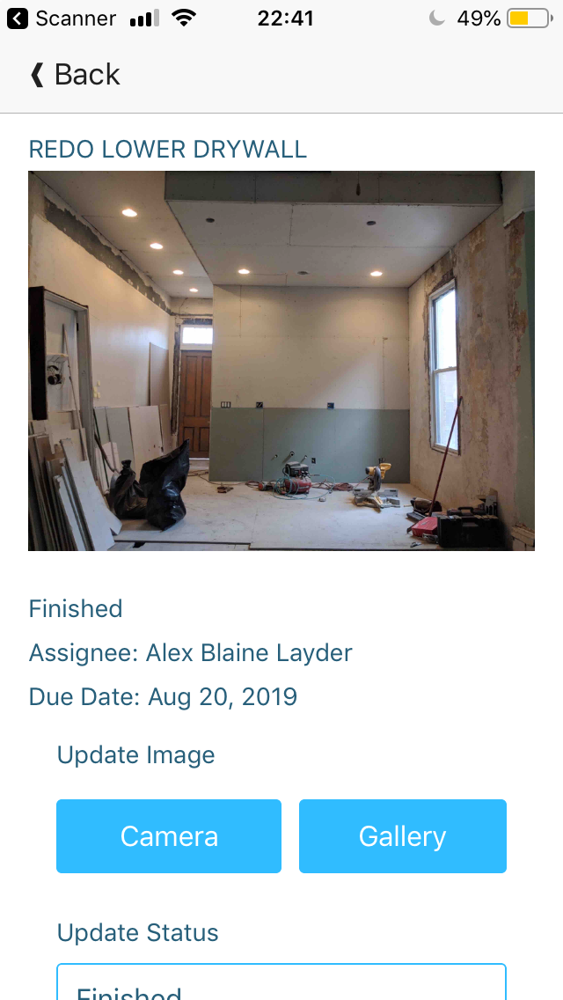

# Everything You Need with Kinvey Studio Custom Code

Kinvey Studio allows you to build web and mobile applications with ease. There are tons of features to let you quickly build out interfaces, drag and drop elements and use pre-made layouts for a robust application. Shockingly, it turns out our team isn't omniscient so there may be some things you would like to add to your app that we haven't built out yet. For cases like this, we've made a custom component that lets you add the code you need to build out your application. Having the ability to add custom code will give you endless options.

Let me show you how to add your own code. To be totally honest, I was hard-pressed to find features I wanted to add that didn't already exist in our platform. Fear not, I thought of some good examples. First we'll make a really quick application that has a login page, a master list of items, a detail page for each item and a form to add more items. For this example, we're going to have a list of contractor tasks that need finished by an assignee.

Let's start building!

## Building a Base App with Kinvey Studio

### Login Page

When you create an app with Kinvey Studio a login page is pre-built for you, for both mobile and web. The app we're building today is for mobile and this is what that looks like:


As a default the login page will source your users from your Kinvey backend. On that login page there will also be an option for users to register. When a user registers they are automatically added to the user list in your Kinvey backend. Want other login methods? You can easily add other login options with Kinvey's [Mobile Identity Connect](https://devcenter.kinvey.com/rest/guides/mobile-identity-connect) service.


### Master List Page

Now that we can get users in, let's give them something to look at. We'll start by creating a list view of all the jobs a contractor has assigned to workers. The view will have the current image of the job, the name and a line that states the progress of the job. To make a list view we just need to add a new view, pick the layout we want and assign the data mappings from our collection.


This is what that list looks like on my phone (an iPhone SE (it's the smallest phone that still pairs with the newest Apple Watch (I have small hands))). Just a reminder, you can also run this on an android device.


### New Job Form

What's a list if the user can't add more? Kinvey Studio makes this really easy: simply click on the view's setting gear and choose 'Create Form'. Based on the data model of your collection it will instinctively choose the form inputs for each column entity. You can rearrange and customize the form more on its layout page.


After we've got the form just how we want it, we can go back to the original view and add a button to click for a new job. We assign that button's action to open up the form we just created. Easy as pie ([here](https://knowyourphrase.com/easy-as-pie) is this idiom's origin story, if you were curious like me).


### Details Page

We want the user to be able to see the detail of that job when they click it, so we'll need to create that detail page. For now, we're going to use the blank layout, add some components and populate them by setting data mappings. This is the most simple, straightforward way to create the detail page.


We can even add a form that is also mapped to our collection to update information for the particular job we are viewing.


## Adding Custom Detail Page

That was all quite easy. So easy that we have extra time before our imaginary deadline. When is the last time you said that? With this extra time we can make the details page even more customized by adding some features with custom code.

### The Custom Code View

In Kinvey Studio you can choose a custom code view for both mobile and web. Today we're doing mobile which is based on our [NativeScript framework](https://www.nativescript.org/). Using NativeScript you can code in Angular, Vue.js, TypeScript, or JavaScript to create native Android and iOS apps. Kinvey Code works with the Angular version of NativeScript, so that's what we'll be using in the custom code component.


As you can see Kinvey Code builds out an `html`, `css`, and a TypeScript file with basic set up information. You can start entering code from scratch but today we'll copy over the code from our current `JobsDetail_Mobile` view. This way we can get the gist of how to add custom code but immediately see some helpful changes.

### Customizing Existing Code

When we bring over the code from our existing view, we want to make sure to change the code pertaining to the file name of our new component in the TypeScript file:

`jobs-custom-detail-mobile.component.tns.ts`

```js
@Component({
    templateUrl: './jobs-custom-detail-mobile.component.html',
    styleUrls: ['./jobs-custom-detail-mobile.component.css']
})
```

&&

```js
export class JobsCustomDetailMobileViewComponent implements OnInit {
```


Once that is all set we just want to make sure we set the new detail view as the navigation destination when a user clicks a job on the list.


#### See Me Scrollin'

Moving over to the template/`html` file, we first want to make sure the page scrolls since everything we have listed on the page doesn't fit the user's screen. To do this we just need to wrap every piece of code in the `ng-container` with in a NativeScript [`ScrollView` component](https://docs.nativescript.org/angular/ui/ng-ui-widgets/scroll-view):

```html
<!--jobs-custom-detail-mobile.component.tns.htmi-->

<ActionBar title="">
</ActionBar>

<ng-container *ngIf="{ jobs: jobsService.dataChanges | async } as $data">
    <ScrollView>
        <StackLayout orientation="Vertical" class="custom-page" (loaded)="onViewLoaded($event)">
...
        </StackLayout>
    </ScrollView>
</ng-container>
```


#### Making `status` Stand Out

Now that we can see everything with ease, let's make the job status stand out with some color 🌈. To do this we're going to start using some Angular [`ngClass`](https://angular.io/api/common/NgClass) magic. We'll make a conditional statement that checks to see if the status is "Stalled", "In progress", or "Not started". Dependent on the result we'll turn the background of the status section yellow, green, or red respectively.

```html
<!--jobs-custom-detail-mobile.component.tns.html-->
        <Label
            text="{{$data.jobs?.status}}"
            textWrap="true"
            [ngClass]="{'green': $data.jobs?.status === 'In progress',
                        'red': $data.jobs?.status === 'Not started',
                        'yellow': $data.jobs?.status === 'Stalled'}"
        >
        </Label>
```

Of course we also need to add these corresponding styles for these classes. We can do that in the provided `css` file:

```css
/**jobs-custom-detail-mobile.component.tns.css**/
.green {
    background-color: lightgreen;
}
.red {
    background-color: pink;
}
.yellow {
    background-color: lightgoldenrodyellow;
}
```

Now we've got a way to make the status stand out so that the contractor and their crew quickly know what needs work.


#### Removing Superfluous Images

In the last demo you may have noticed the picture for the job was shown twice. This is a default for the form we added in the section to upload an updated picture. Since we already have the current picture we can take this out of the form. In the pre-made view, where this code originated, we get a warning when we try to change the code in the editor. This is because that code is generated as you manipulate the view in the editor. Really, it's quite a saving grace so you can't break anything you've created. Like any of us have ever messed up something we created trying to tweak a little something here and there (#thanksgoodnessforversioncontrol).

Since we've left land of generated code, we can take out the code that's giving us the extra image. Ready for a long line of code?

```html
<Image
  *ngIf="mobiletakepicture0.picture || (mobiletakepicture0.value && mobiletakepicture0.value._downloadURL)" [src]="mobiletakepicture0.picture || (mobiletakepicture0.value && mobiletakepicture0.value._downloadURL)
  "height="200">
</Image>
```

It is great to see how the stored picture is pulled in but we just need the one the user wants to upload. That means in both the `*ngIf` conditional and the `[src]` value we can remove the `||` and everything after it. Then we are left with:

```html
<Image *ngIf="mobiletakepicture0.picture" [src]="mobiletakepicture0.picture"
  "height="200">
</Image>
```
Now when we scroll we see no image listed but when a user wants to update an image they can see a preview of the image they've chosen.


#### Livin' That Pipe Dream

The last thing I wanted to do was make the job name a little more legible and clean up the date. I did this using Angular [pipes](https://angular.io/guide/pipes). 

```html
<!--jobs-custom-detail-mobile.component.tns.htmi-->
...
<Label text="{{$data.jobs?.name | uppercase}} " class="-data-label" textWrap="true"></Label>
...
<Label text="Due Date: {{$data.jobs?.due_date | date}}" textWrap="true"></Label>
...
```

After changing this in the custom code I realized I could have changed this in the pre-made version Kinvey Code provided. Under the properties section, when you assign text to a label you can actually pass in Angular template expressions. This means you can use pipes right there in the text input section of your view property.


See, just when I think something that I need to do with custom code, it turns out the Kinvey Studio team has it taken care of 😍. Here's what that look like now, all nice and tidy.



With that last bit we have our app just how we want it. The pre-made views and components let us build out a robust app with ease and the custom code let us get everything else we wanted to add.

## Resources, Just for You ;)
I hope that you're so inspired and are filled with 80 million ideas of what you want to create. Here are some other resources to help you on your coding way:

- [Install Kinvey Studio](https://studio.kinvey.com/)
= [An Introduction to Kinvey Studio](https://studio.kinvey.com/)
- Tired of reading? [Here's a quick video introduction.](https://www.youtube.com/watch?v=QZbcskYIEmI)

I can't wait to see what you create. Happy Coding!

