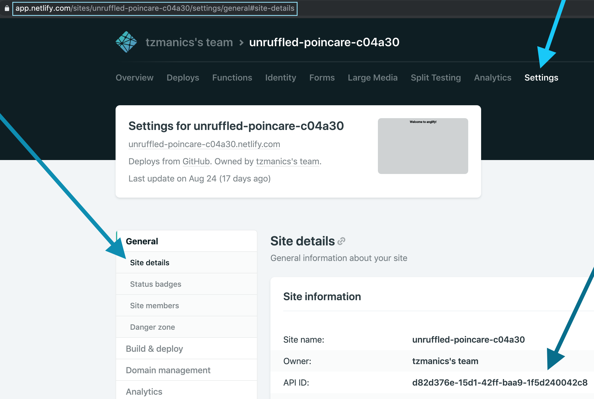
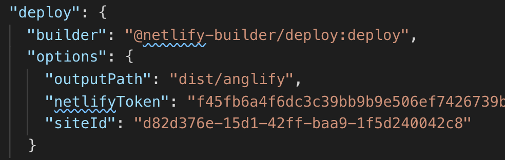
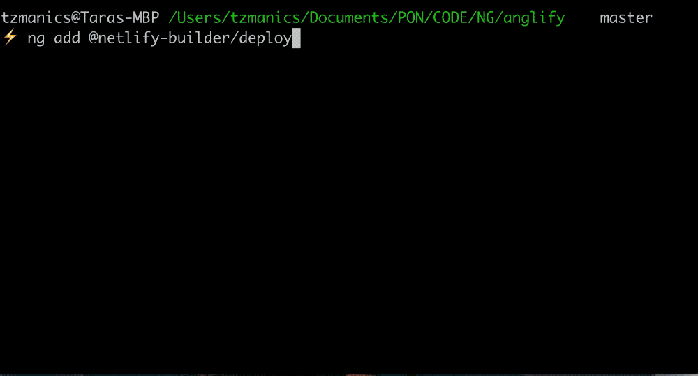
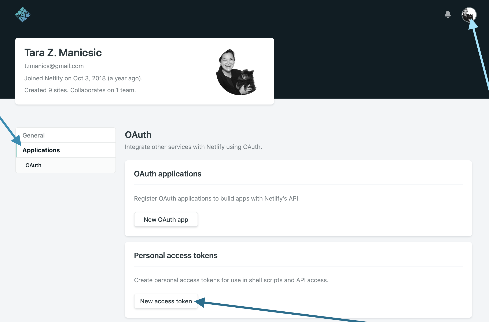
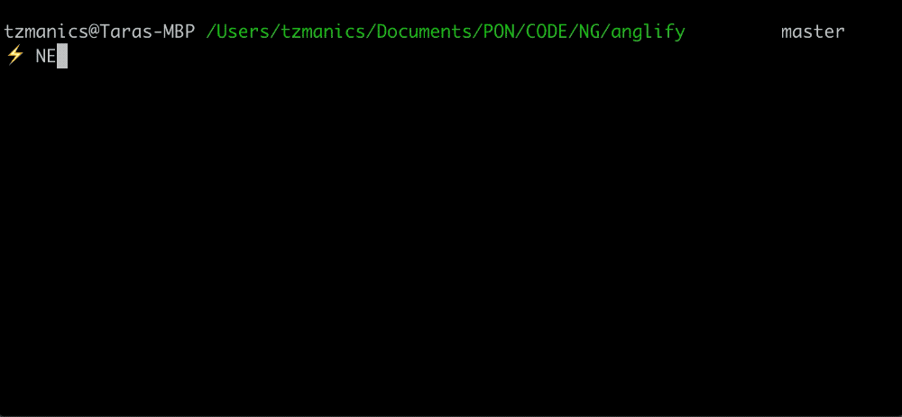
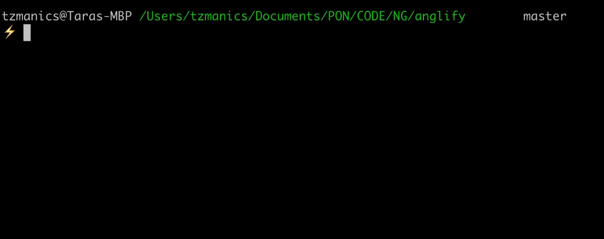

# Using the Netlify Builder

I was super stoked to try out the [Netlify Builder](https://github.com/ngx-builders/netlify-builder) built for the Angular CLI by [Santosh Yadav](https://www.santoshyadav.dev). It's _super_ easy to use. One thing I was hesitant 😬 about was putting my personal access token in the public `angular.json` file. So, instead I made a script to deploy any project passing in my token as an environment variable. Come code with me 🤗.

## First step: add the builder 🛠

To add the the builder we first want to add it to our Angular project with the handy `ng add` command.

*# command line*

`ng add @netlify-builder/deploy`

Running this command will walk us through setting up the builder. It first asks for the project API ID or Site ID of your Netlify project. We can find this by going to the project page clicking 'Settings' in the top menu, then 'Site Settings' under the 'General' menu tab (https://app.netlify.com/sites/\<your site name\>/settings/general#site-details) 



The next step in the builder setup asks for our Personal Access Token but we don't want to put that in a public file. If we do add it in this setup the builder adds that information to the `angular.json` file.



The way Santosh set up the builder we don't have to add the Token here, [instead it will check for an environment variable](https://github.com/ngx-builders/netlify-builder/blob/master/command-builder/deploy/index.ts#L33). So, we just hit enter to skip that part.



## Second || Final Step: setting the Token 🗝 variable 
We want to set the token by using an a `process.env` global variabl. To find your Netlify Token just head to [your application's token generating page](https://app.netlify.com/user/applications/personal) or click on your avatar, the 'User Settings' option, click 'Applications' in the left menu, then click the 'New access token' button under 'Personal access tokens'. We can type anything that is a good reference for you as the description of your token and click the 'Generate' button.



> NOTE: Make sure you copy the newly created token once it's generated. You can't view it again after you leave that page. You can always create a new one though 😎👍.

 Normally, we would just need to write the command `ng run <project name>:deploy`. With this environment variable we now write:

*# command line*

`NETLIFY_TOKEN=<token> ng run <project name>:deploy`



## 🌈 Way Cooler Last Step 🧜‍
Why type all that when we can make a shell command where we pass in the project name (aka the name of the folder in the app's dist directory) for whichever app we're working on 💁🏻‍. In our `.bashrc` file we make a function of any name, in this case we'll call it `netliLove`. Since we can use this token for all of our projects we can pass that in as a static asset but since the project name will change we'll make it dynamic. With bash scripts you can add a dollar sign (`$`) and a digit to represent a  [positional parameter](https://www.gnu.org/software/bash/manual/html_node/Positional-Parameters.html) and pass an argument when you run the function. Using `$1` will make it so when we call `netlilove <project name>` it will run the deploy command and populate the project variable with our project name.


*# ~/.bashrc*

```bash
netliLove() {
  NETLIFY_TOKEN=<token> ng run "$1":deploy
}
```


## No 🙅🏻‍ More Steps

That's it! Whichever way you decide to use the builder, I hope you had a fun time setting it up. At least, I hope you found it to be a painless process. I really appreciate Santosh putting the work into creating this builder AND making it [open source](https://github.com/ngx-builders/netlify-builder). If you'd like to contribute or check out the code you can find it [here on github](https://github.com/ngrx-builders/netlify-builder) and you can learn more about Santosh [on his website](https://www.santoshyadav.dev/). Happy coding, everyone! 