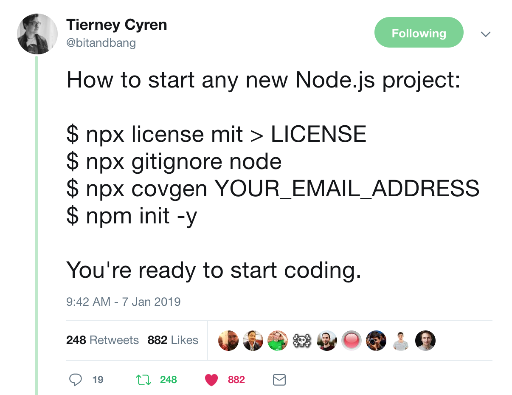
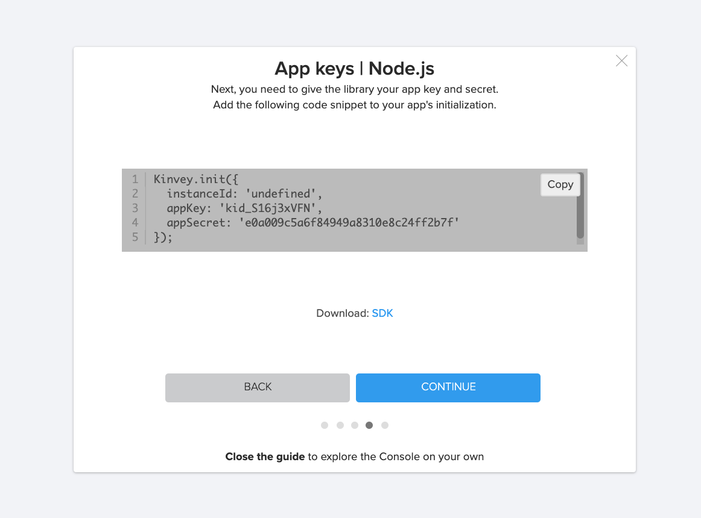
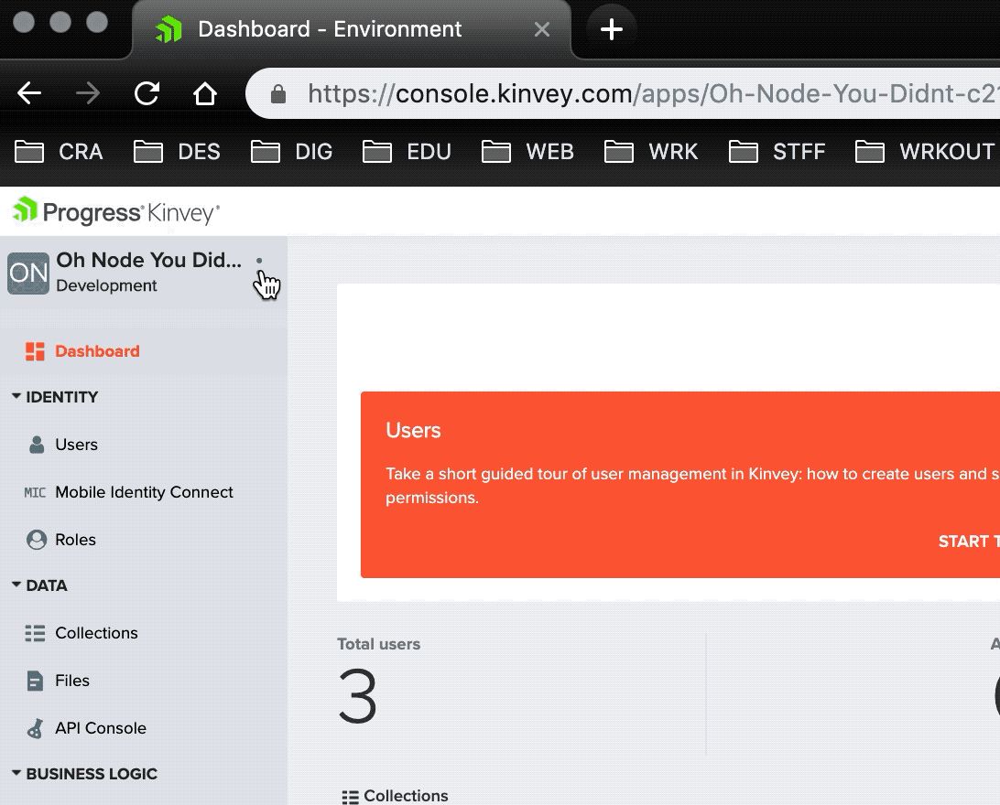

# Getting Started with Node & Kinvey
This is a quick post to help you get up and running with a new Node project connected to a Kinvey backend. Let's just jump right in!

## Creating a Node Project
I make a lot of Node projects, some even see the light of day 😛, so I have a script to spin one up. I got the idea from [this tweet](https://twitter.com/bitandbang/status/1082331715471925250) from [Tierney Cyren](https://twitter.com/bitandbang/) and learned even more from [this post](https://philna.sh/blog/2019/01/10/how-to-start-a-node-js-project/) by [Phil Nash](https://twitter.com/philnash).



As the tweet says, to get a Node project started you can just type this in your terminal :

```
npx license mit > LICENSE
npx gitignore node
npx covgen <your email address>
npm init -y
```

What all is happening here? We're using [`npx`](https://medium.com/@maybekatz/introducing-npx-an-npm-package-runner-55f7d4bd282b) to use an npm module whether we have it installed or not. First, [`license`](https://www.npmjs.com/package/license) to generate the MIT license, [`gitignore`](https://www.npmjs.com/search?q=gitignore) to fetch a Node.js `.gitignore` file, and [`covgen`](https://www.npmjs.com/package/covgen) to generate the [Contributor Covenant](https://www.contributor-covenant.org/) inside your project directory using your email as the contact info. Finally, we run `npm init -y` to spin up a `package.json` file for the project. The `-y` or `--yes` flag uses the [defualt values](https://docs.npmjs.com/creating-a-package-json-file#default-values-extracted-from-the-current-directory) or the configs you can set using `npm.set`.

```
npm set init.author.email "example-user@example.com"
npm set init.author.name "example_user"
npm set init.license "MIT"
```

That's it! I have a shortcut in my `~/.bashrc` file so that I can just type `node-project` in an empty directory and it spins all this up plus initializes `git` in the directory and makes the first commit. Nash explains it in-detail in his post I listed above. Here's what my function looks like:

```
function node-project {
  git init
  npx license mit>LICENSE
  npx gitignore node
  npx covgen "$(npm get init.author.email)"
  npm init -y
  git add .
  git commit -m 'initial commit'
}
```
> 🐙 you can check out [this project's repo](https://bit.ly/2I1AFnO) to see what we have so far.

## Connecting to Kinvey
Now that we have our base project we get to connect it to our Kinvey backend. First things first, we'll want to install the [Kinvey SDK](https://github.com/Kinvey/js-sdk), which is open source 😃.

```npm i kinvey-node-sdk```

_*As long as you're using an updated version of npm you do not need to use the --save/-s flag to save the module as a dependency, it does it automatically._

Once we have that installed we just need to include the SDK in our project and initiate Kinvey with our project's key and secret. When you create a project with the Kinvey guide it will show you your information in one of the pop-up windows.



Otherwise, you can always find the project's App Key and App Secret in the top left corner of project's homepage in the console when you click the 3 dots next to the project's name.



We're going to initiate Kinvey and pass in out project info in our project's main file: `app.js`.

```js
// app.js

const Kinvey = require('kinvey-node-sdk')

Kinvey.init({
  appKey: 'kid_S16j3xVFN',
  appSecret: 'e0a009c5a6f84949a8310e8c24ff2b7f'
);
```

That's the super simple way to connect to Kinvey. You can also add a few lines of code to test out your connection. Just add this under your `Kinvey.init`:

```js
Kinvey.ping().then((response) => {
  console.log(`Kinvey Ping Success! Response: ${response.kinvey}`);
  }).catch((error) => {
    console.log(`Kinvey Ping Failed. Resonse: ${error.description}`);
  });
```

If you get `Kinvey Ping Success! Response: hello <your project name>` you're golden. If not, you can check out some [documentation here](https://devcenter.kinvey.com/nodejs/guides/getting-started) to help you troubleshoot.

> [🐙 Here's](https://github.com/tzmanics/node-kinvey-base-project/commit/956eb024751eaad432183fc2a03096b864b85168) the commit that has all the changes we've made so far.

### Optional Fun 🤓

Ideally you don't want any of your keys and secrets online so I always put them in a config file. Then I add that file to my `.gitignore` list so it never gets pushed up.

```js
// config.js

const config ={
  kinvey: {
    appKey: 'kid_S16j3xVFN',
    appSecret: 'e0a009c5a6f84949a8310e8c24ff2b7f'
  }
}

module.exports = config;
```

With that we only need to pass that `config` object to the `Kinvey.init` function in our `app.js` file.

```js
// app.js

const Kinvey = require('kinvey-node-sdk');
const config = require('./config');

Kinvey.init(config.kinvey);
```

Such concise! Remember it's important to add the `config.js` file to your `.gitignore` if you're using version control. But of course you are 😘.

*`.gitignore`*
```
...
# config stuff
config.js

```

To make sure your config file is being ignored. Run `git status` and make sure it's not listed before pushing your code up.

> [🐙 Here](https://github.com/tzmanics/node-kinvey-base-project/commit/503a016c215dd8e41fef7ae8756d0b50aef0ac92) is the commit that shows the changes plus has an example config file.

## Next Steps
We're all set up! Pretty easy, right? What will we do next, such possibilities. Here are some great resources to help you on your coding journey:

- The [official documentation for starting a project](https://devcenter.kinvey.com/nodejs/guides/getting-started) has more configuration settings and information on connecting to Kinvey.
- Our [Node.js Users Guide](https://devcenter.kinvey.com/nodejs/guides/users) will help you start adding and managing your users.
- [Tutorials](https://devcenter.kinvey.com/nodejs/tutorials) can help you add business logic and collection hooks to your application.
- Check out [this blog post from Brian Rinaldi](https://www.progress.com/blogs/getting-started-with-kinvey-flexservices) on getting started with Kinvey FlexServices.
- You can also join one of our [Getting Started Webinars](https://www.progress.com/campaigns/kinvey/getting-started-with-kinvey) to learn more and ask us questions.

Whichever direction you go next, remember you can always reach out to us on Twitter at [@Kinvey](https://twitter.com/Kinvey). Happy coding 👩🏻‍💻!
