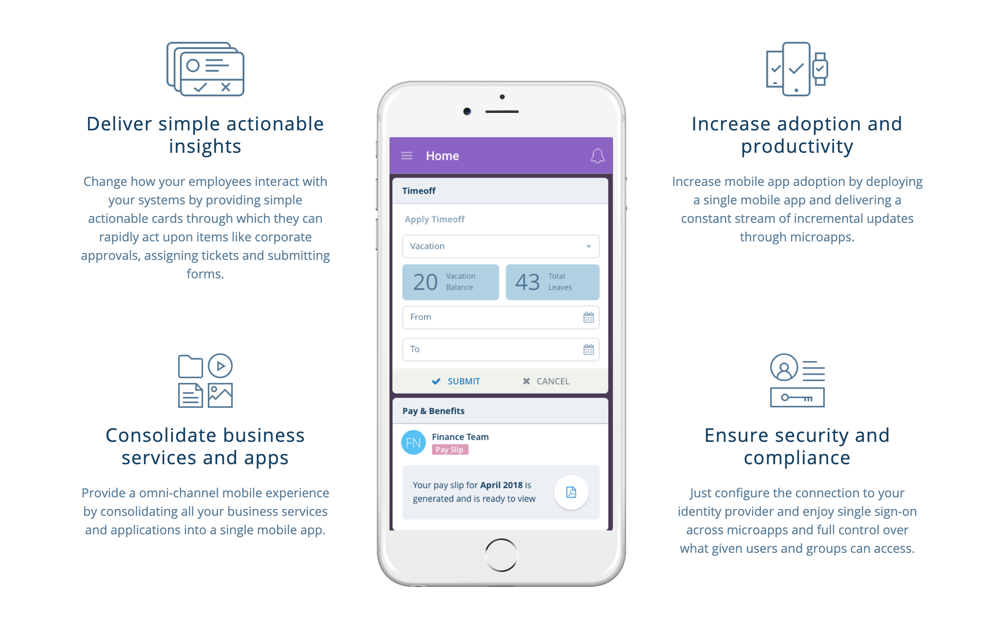

# What is a Microapp?

Although you may see more articles on micrapps popping up recently, the term and development strategy has been around for some time. The first search result for microapps was an [article on 'Micro Apps' from Forbes](https://www.forbes.com/sites/adrianbridgwater/2015/07/16/what-are-micro-apps-and-why-do-they-matter-for-mobile/#1860a2786338) in 2015. The author even predicted that soon they may even be commonly referred to with the single word: microapp. Modern-day Nostradamus, I tell ya 😉. So, what _is_ a microapp?

*A microapp is an app that is highly focused on performing just one task.*

In software engineering terms, this is akin to the [single responsibility principle](https://en.wikipedia.org/wiki/Single_responsibility_principle) which states that, "a class should have one and only one reason to change." In other words, it only has one job and it, hopefully, does it well. Instead of having an app that has every task an employee _can_ do (e.g. report time off, submit expenses, choose benefits, search employee directory, upload shared resources, etc.) there are microapps that handle each of those tasks specifically.

As consumers, we've been using microapps for a while: the flight search box in Google, calendar alerts on desktop, WeChat, and so many more.

Yet, you may not know much about what they are. To save you some time, here are the 4 top things I've learned about microapps:

- They reduce complexity for developers and users.
- Microapps are not the same as microservices but the benefits are.
- With microapps, more is less but more is also more (SO deep, I know).
- Creating a microapp is fast and easy.

If that's enough info for you, awesome 👍 you can make some [here](https://www.progress.com/labs/microapps). If not, let me tell you a little more about each of these points. If you're not a fan of reading, you can also just listen in on this webinar: [What are Microapps–and Why You Should be Using Them](https://www.progress.com/campaigns/kinvey/webinar-5ways-microapps).

## Reducing Complexity for Developers and Users
Microapps help you breakdown your large, cluttered apps into smaller, consumable apps which benefits both the developers and the users. This strategy lets developers customize the UI and navigation to better suit the _one task_ that a user needs to accomplish. Users are more likely to interact with an application if it is easier and more enjoyable to use. I hate the cognitive energy that's used just to _get_ to the application I need to carry out a task.

Many of your users may not even be using the numerous features in your app but have to take the time to navigate to the one or two they actually need. A one-stop shop may have everything you need, but what section are the batteries in? How far back do you have to go to find them? I would rather just go to the battery drive-thru. As far as I know this doesn't exist, but I wouldn't be mad if it did. All this to say, make it easy for users to get a task done and they'll do it more. They may even enjoy it too!

Another pain point for developers and users is authentication. For a developer, having to keep track of the chain of permissions for users throughout a complicated app can be truly mind-boggling. Of course a team can have a reference that says which users have what access on which part of the app at what time. As complicated as that is, what about when you have to change a users permission on the fly? For instance, when an employee leaves a position at a theme park and should no longer be able to order free guest passes. Not that anyone would take advantage of that (if you know someone who is in this position, my email is tmanicsi@progress.com and I LOVE theme parks!). With a microapp you only need to worry about authentication and permissions for the _one_ task that's being accomplished. For a user, this may mean that they only have to give credentials upon opening the app.

*from [Eloha](https://eloha.io/) microapps platform*

When users don't have a clear path to completing a goal, they tend to make more work for more people. Complexity can lead to confusion. For instance, I was trying to find a list of an employees for a team in a company. The directory was a part of an app that had a lot going on and navigating to the directory took some time. Then it was even more confusing once I was in the directory. So, instead, I sent a message to a team manager on Slack, who then sent an email to an HR person, who found the info then sent it back down the chain. After all that, I didn't even end up using the information 🤭. All this because I couldn't easily accomplish the task using their application. There are many cases like this though: sending an email to the support team because a user can't submit a ticket through the app, calling a support center because you can't find something on a company's app, etc. The more straightforwrd and simple you can make an app the less likely you are to run into these time sucks.

## Microapps vs. Microservices
Microservice architecture is a strategy of breaking up an application into services that are lightweight and loosely coupled. This is pretty synonymous with microapps, the main difference being scale and size. The term 'microservices' refer to services used from frontend to backend, usually using an APIs and/or message-broker software to communicate between all the services. The term 'microapps' usually just refers to ehe UI layer. With both of these techniques, though, you are pairing down large, complex structures into more focused, more easily managed pieces.

Just like machines and kindergarten plays, the less moving parts, the easier it is to manage.

So, with both microapps and microservices you have applications that have less moving parts; your microapp or microservice is only handling one task. Instead of worrying about breaking the billing part of your application when you go to change the data visualizations, you can have each as their own app and only break one (preferably you would break none 😉). This also makes the transition to newer coding strategies or technologies easier. Instead of having to update a huge project all at once, you can just update it piece by piece. If a part of you app needs to be deprecated you don't have to fish through a large application to find everything that may break by removing it. Since it's loosely coupled, you can make a clean cut.

## Less is More && More is More
There is good and bad to this strategy. Less is more because you can re-use the pieces of microapps to form different applications. You don't have to re-write the same pieces of a UI, instead you are just configuring the parts you already have. With this strategy you are also giving your users a consistency across many apps so they have familiar UIs and are then easier, more intuitive to use.

The flip side to that coin is that you now have more applications. This is when more is, well, more. If you take apart an application that has 5 tasks, you now have 5 apps. The saving grace here, is the likelihood that creating and maintaining those 5 individual apps is easier than creating and maintaining the one complex app thanks to the [atomic design](http://bradfrost.com/blog/post/atomic-web-design/) of microapps. It's not likely that you will hear an engineering manager say, "Stop, we have too many working apps that help our users complete their tasks!" In the end, it will come down to user satisfaction and ease of maintenance for the developers.

## Fast & Easy to Create
With the microapp structure, since developers will be able to re-use parts of microapps to create other apps, development time will be faster. Developers and engineering hours are usually one of the scarcest resources for a company. Microapp creation lets developers be more impactful and proficient with the time they have. Having a simplified development process gives you time to create the features and changes that users are requesting from your apps. Since creating a microapp is less technical than coding out an application from scratch more people will be able to help develop apps.

Making changes to your apps is also fast because the container knows to check-in when a user is engaging with the app, to see if anything has been changed. Mobile apps are especially hard to update when you have to go through a submission to an app store. Not only are you cutting the time it takes to make the update but you also don't have the wait time for changes to be accepted. Time is precious when it comes to getting users what they need and retaining the users you have.

## Are Microapps for You?
Maybe microapps are just what you were looking for. If so, great. If you still have questions, well, that's great too. Either way, here are some resources to help you on you microapp journey:

- Check out [eloha](https://eloha.io/) to learn more about microapps and/or get started.
- [Reach out](https://www.progress.com/labs/microapps) to someone from my team to ask specific questions.
- Read [this article](https://www.progress.com/blogs/simplify-organization-app-sprawl-enterprise-micro-application-architecture) about Enterprise Micro-Application Architecture.
- Come to [Progress Next](https://www.progress.com/next/sessions/building-an-enterprise-mobile-portal-in-under-30-minutes-with-microapps) to learn how to make a Enterprise Mobile Portal in 30 minutes with microapps!

Whichever route you choose, happy coding!
