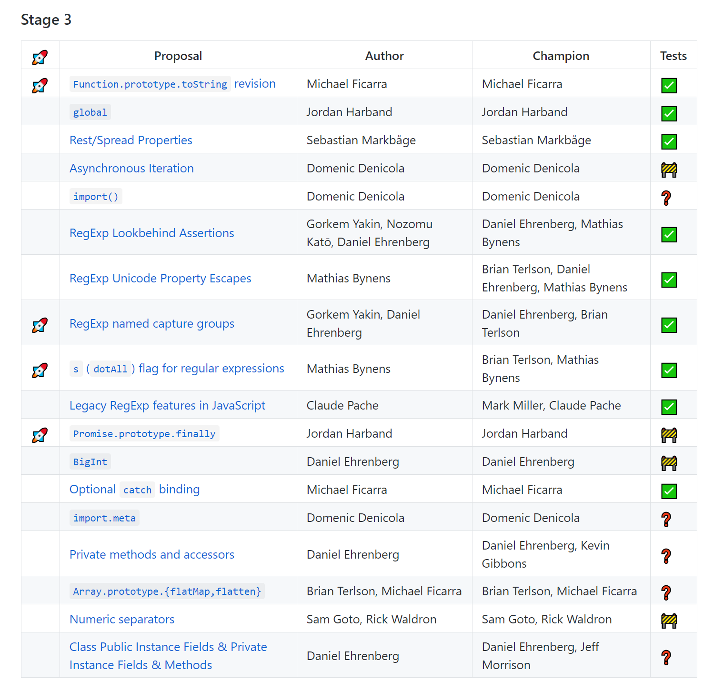
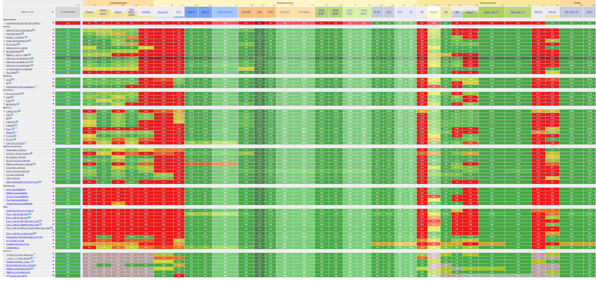
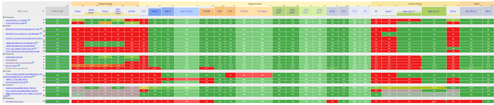
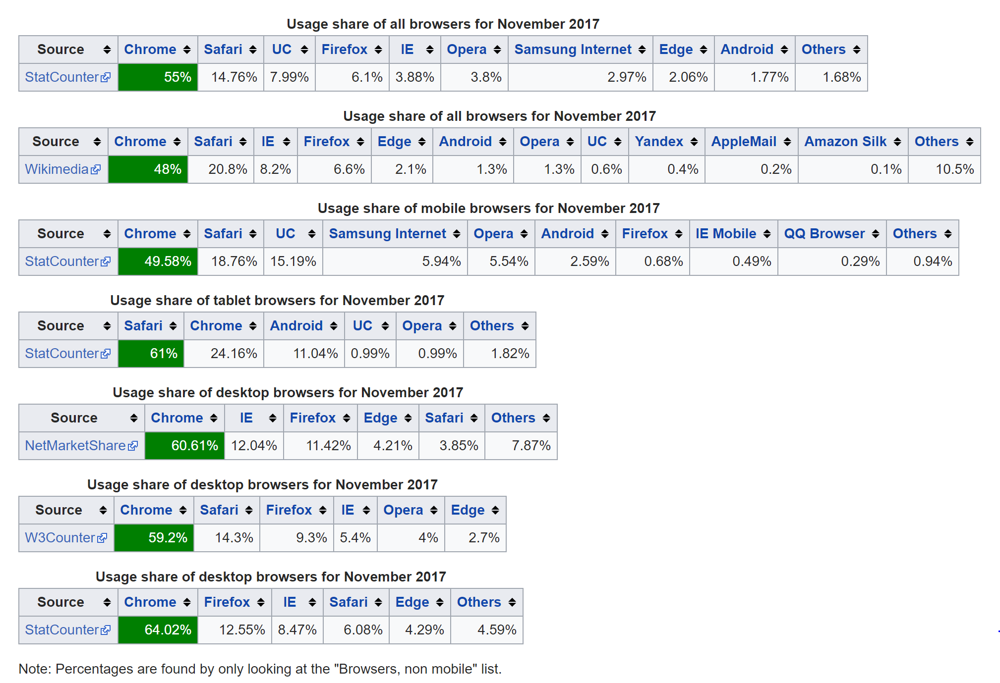
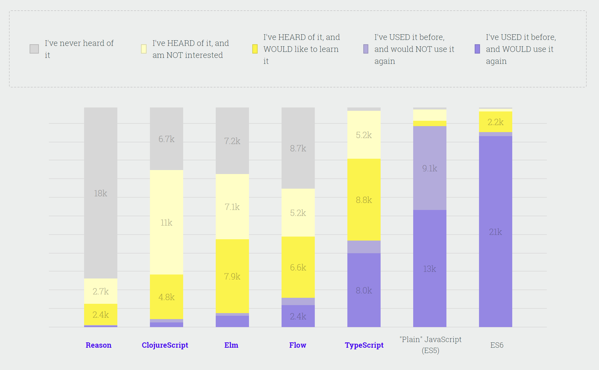
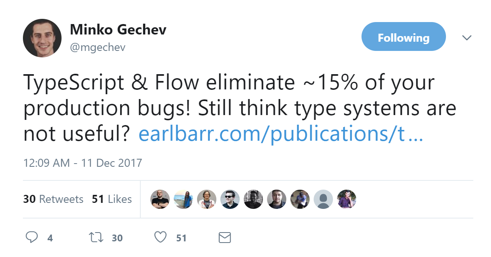
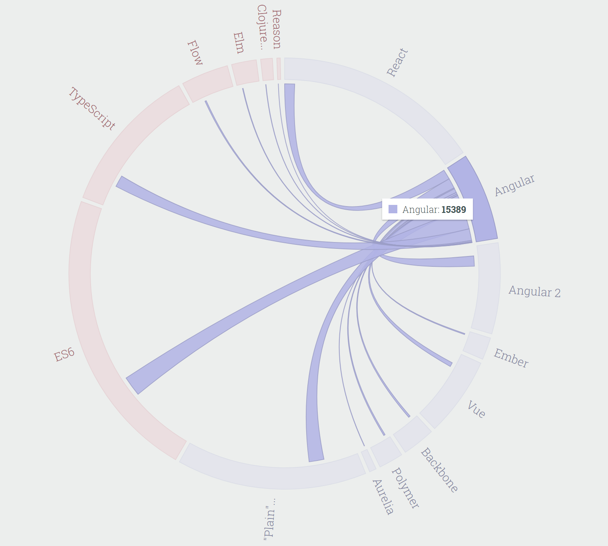
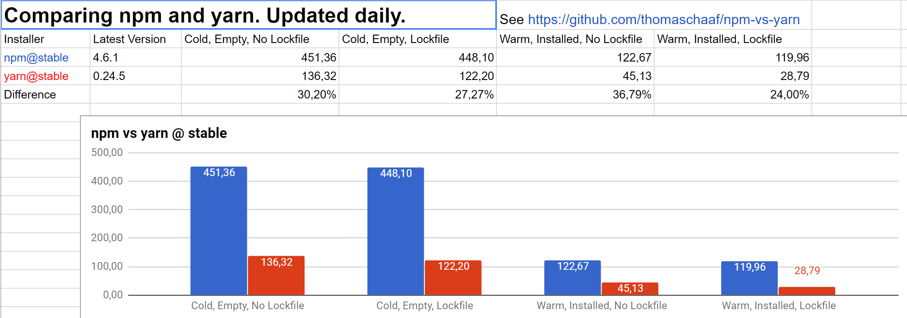

# JavaScript's Journey Through 2017

Another year has gone by and JavaScript is still going strong. Probably not a surprise to any of us but may be to the demise of some. Hopefully, options overload and the complexity of coding in JavaScript has not made anyone throw their computer out the window. In reviewing JavaScript in the past year, there are a few topics that stand out that I'll be covering:

- ECMAScript Goodies
- How to JavaScript in 2017
- Package Manager Rumble
- PWAs: The JavaScript Overview

There are may be other things I could cover, if you think of any, add a comment, let's discuss! Okay, here we go.


*deep breath in*

## ECMAScript Goodies

Let's check in with [ECMA International, Technical Committee 39](https://github.com/tc39)! It turns out the 6 in ES6 does not stand for the number of years it takes for a release. I kid! Since ES6/ES2015 took so long to release (6 years, hence my jab) the committee decided to move to a yearly small-batch release instead. I'm a big fan of this and I think the momentum keeps things moving and JavaScript improving. What presents did we get for ES2017 and what's on our list for ES2018?

**You can learn more about the TC39 process of proposals [here](tps://tc39.github.io/process-document/)*

### ES2017
In January, at the TC39 meeting, the group settles on the ECMAScript proposals that would be slated as the features of ES2017 (also referred to ES8, which probably should be nixed to avoid confusion). This list included:

**Major features**
-	[Async Functions](https://github.com/tc39/ecmascript-asyncawait)
-	[Shared Memory and Atomics](https://github.com/tc39/ecmascript_sharedmem)

**Minor features**
-	[`Object.values/Object.entries`](https://github.com/tc39/proposal-object-values-entries)
-	[String padding](https://github.com/tc39/proposal-string-pad-start-end)
-	[`Object.getOwnPropertyDescriptors()`](https://github.com/tc39/proposal-object-getownpropertydescriptors)
- [Trailing commas in function parameter lists and calls](https://github.com/tc39/proposal-trailing-function-commas)

### Async/Await
[Proposed by: Brian Terlson](https://github.com/tc39/ecmascript-asyncawait)

I'm starting here because it was first on the list and my level of excitement is pretty high for this nifty addition. In ES6 we got [`promises`](https://developer.mozilla.org/en-US/docs/Web/JavaScript/Guide/Using_promises) to help us with the all too familiar condition commonly known as...


CALLBACK HELL 😱.

 The `async/await` syntax reads entirely synchronously and was insipired by TJ Holowaychuk's [Co](https://github.com/tj/co) package. As a quick overview, `async` and `await` keywords allow you to use them and `try/catch` blocks to make functions behave asynchronously. They work like generators but are not translated to Generator Functions. This is what that looks like:

```js
// Old Promise Town
function fetchThePuppies(puppy)
  return fetch(puppy)
    .then(puppyInfo => puppyInfo.text())
    .then(text => {
      return JSON.parse(text)
    })
    .catch(err => {{
      console.log(`Error: ${err.message}`)
    })
}
```

```js
// New Async/Await City
async function fetchThePuppies(puppy)
  try {
    let puppyInfo = await fetch(puppy)
    let text = await puppyInfo.text()
    return JSON.parse(text)
  }
  catch (err) {
    console.log(`Error: ${err.message}`)
  }
}
```

This doesn't mean you should go in and replace all promises in your code with `async/await`. Just like you didn't go in and replace every function in your code with arrow functions (one hopes), only use this syntax where it works best.

### Shared Memory and Atomics
[Proposed by: Lars T. Hansen](https://github.com/tc39/ecmascript_sharedmem)

Wait, did we enter a theoretical physics class? Sounds fun, but no. This ECMAScript propsal joined the ES2017 line up and introduces `SharedArrayBuffer` and a namespace object `Atomics` with helper functions. We'll dive in a little but for a more detailed look: [Dr.Axel to the rescue!](http://2ality.com/2017/01/shared-array-buffer.html) Super high-level (pun intended), this proposal is our next step towards [high-level parallelism in JavaScript](http://2ality.com/2017/01/shared-array-buffer.html).

We're using JavaScript for more and more operations in the browser relaying on Just-in-Time compilers and fast CPUs. Unfortunately, as Lars T. Hansen say in his awesome post, [A Taste of JavaScript’s New Parallel Primitives](https://hacks.mozilla.org/2016/05/a-taste-of-javascripts-new-parallel-primitives/) from May 2016:

> But JS JITs are now improving more slowly, and CPU performance improvement has mostly stalled. Instead of faster CPUs, all consumer devices — from desktop systems to smartphones — now have multiple CPUs (really CPU cores), and except at the low end they usually have more than two. A programmer who wants better performance for her program has to start using multiple cores in parallel. That is not a problem for “native” applications, which are all written in multi-threaded programming languages (Java, Swift, C#, and C++), but it is a problem for JS, which has very limited facilities for running on multiple CPUs (web workers, slow message passing, and few ways to avoid data copying).

#### `SharedArrayBuffer`

This proposal provides us with the building blocks for multicore computation to research different approaches to implement higher-level constructs in JavaScript. What might those building blocks be? May I introduce you to `SharedArrayBuffer`. [MDN](https://developer.mozilla.org/en-US/docs/Web/JavaScript/Reference/Global_Objects/SharedArrayBuffer) had a great succinct definition so I'll just plop that in right here:

> The `SharedArrayBuffer` object is used to represent a generic, fixed-length raw binary data buffer, similar to the `ArrayBuffer` object, but in a way that they can be used to create views on shared memory. Unlike an `ArrayBuffer`, a `SharedArrayBuffer` cannot become detached.

I don't know about you but the first time I read that I was like, "wat."


Basically, one of the first ways we were able to run tasks in parrallel was with web workers. Since the workers ran in their own global environments they were unable to share, by default, until communication between the workers, or betweeen workers and the main thread, evolved. The `SharedArrayBuffer` object allows you to share bytes of data between multiple workers and the main thread. Plus, unlike it's predecessor [`ArrayBuffer`](https://developer.mozilla.org/en-US/docs/Web/JavaScript/Reference/Global_Objects/ArrayBuffer) the memory represented by `SharedArrayBuffer` can be referenced from multiple agents, web arokers or the web page's main program, simultaneously. You can do this using [`postMessage`](https://developer.mozilla.org/en-US/docs/Web/API/Worker/postMessage) to *transfer* the `SharedArrayBuffer` from one of these agents to the another.

#### `Atomics`

When sharing a `SharedArrayBuffer` betwixt (keeping it classy) agents, each of those agents can read and write to its memory at any time by creating `TypedArray` views on the buffer and using standard array access on the view. So, how do you keep this sane and organized, making sure each agent knows to wait for another agent to finish writing their data? Yes, you read the header, the new top-level object, `Atomics`. This object has atomic operations present as static methods. For now, `Atomics` has only two methods that can be send as signals from one worker to another: `Atomics.wait` and `Atomics.wake`. Hansen talks about more methods, like `Atomics.load`, `Atomics.store` and `Atomics.compareExchange`, to truly implement synchronization.

I could keep diving into this but there are still more awesome propsals to cover, so, if you're interested in learning more check out these article:
- [2ality's rundown of the proposal](http://2ality.com/2017/01/shared-array-buffer.html)
- [A Taste of JavaScript’s New Parallel Primitives](https://hacks.mozilla.org/2016/05/a-taste-of-javascripts-new-parallel-primitives/) from Lars T. Hansen

### `Object.values/Object.entries`
[Proposed by: Jordan Harband](https://github.com/tc39/proposal-object-values-entries)

#### `Object.values()`
I have actually [benefited from the useful addition of `Object.values` recently](https://github.com/tzmanics/U-Go-Hue-Go-Tutorial/blob/5ff8cd88c38f3ad42f40f43aefbda1007b3e391d/src/app/app.component.ts#L34https://github.com/tzmanics/U-Go-Hue-Go-Tutorial/blob/5ff8cd88c38f3ad42f40f43aefbda1007b3e391d/src/app/app.component.ts#L34) when pulling Philips Hue light information from an observable. It allowed me to iterate through my data's values because it returns an array of the object's properties.

```js
// land before `Object.values()`
this.lights = Object.keys(data).map(key => data[key])

// the time is now aka WITH `Object.values()`
this.lights = Object.values(data)
```

Fancy 💅, right?

#### `Object.entries{}`
This method takes what `Object.values()` does one step further. Looking at an object, a data structure of key-value pairs, each of those pairs is an `entry`. When you call `Object.entries()` it is returning an array containing an array for each of those entries.

```js
Object.entries({ name: 'Toshmagosh', age: 12 })
// [[ 'name', 'Toshmagosh' ], [ 'age': 12 ]]
```

It's really quite straight forward, but if you ever want to dive in more, [JavaScript.info](https://javascript.info/keys-values-entries) has a good rundown.

### String Padding
[Proposed by : Jordan Harband, Rick Waldron](https://github.com/tc39/proposal-string-pad-start-end)

I didn't think I was going to have to say this again but, left pad. Yes, the [left pad](http://blog.npmjs.org/post/141577284765/kik-left-pad-and-npm) debacle of 2016 raised the attention of the JavaScript community enough for TC39 to add string padding. To be fair though, it was about time for JavaScript to have some native methods to handle Strings. ✨ Welcome [`padStart`, `padEnd`](https://codeburst.io/learn-javascript-es-2017-string-padding-padstart-padend-88e90783e7de) to the family, which currently was just a lonely `String.prototype.trim` (est. ES5)!


You are all smart people so you probably can surmize what each of these methods do. So, I'll just show you some examples instead of using my words.

```js
// padStart adds padding until string reaches provided length
'puppies'.padStart(22)
// "               puppies"

// or provide a filler instead of blank spaces
'nachos'.padStart(11, 'yum')
// "yumyunachos"

// padEnd works the same but adds to the end of the string
'Carlos Santana'.padEnd(30, '*-^')
// "Carlos Santana*-^*-^*-^*-^*-^*"

// Emoji trickiness
'🍞🥞🥚🌭'.padEnd(8)
// "🍞🥞🥚🌭" // no pad? yup, because the length === 8

```

I've seen this presented as a handy way to align items coming in at different string lengths. Yet, some are wary of "styling" at this level. What are your thoughts?

There are more methods in the pipeline: [`trimStart/trimEnd`](https://github.com/tc39/proposal-string-left-right-trim) is currently at stage 2. This will let us remove starts and ends of strings. Fun fact: this propsal started out with `trimLeft` and `trimRight` but to stay consistent with `padStart\padEnd` has since been updated. Yay, consitency! It also helps with any confusion whether a language is read right-to-left or left-to-right ✅

### `Object.getOwnPropertyDescriptors()`
[Proposed by: Jordan Harband & Andrea Giammarchi](https://github.com/tc39/proposal-object-getownpropertydescriptors)

This is the plural version of [`Object.getOwnPropertyDescriptor](https://developer.mozilla.org/en-US/docs/Web/JavaScript/Reference/Global_Objects/Object/getOwnPropertyDescriptor) which returns a descriptor of the property that's directly on an object, i.e. not on it's prototype chain.

```js
let popcorn = { action: 'pop', butter: true }
let popcornAction = Object.getOwnPropertyDescriptor(popcorn, 'action')

// popcornAction is {
//   value: "pop",
//   writable: true,
//   enumerable: true,
//   writable: true
// }
```

So, using the plural version you are able to capture all of an object's non-inherited (or own) property descriptors. Using the delicious example above:

```js
let popcorn = { action: 'pop', butter: true }
let popcornProperties = Object.getOwnPropertyDescriptors(popcorn)

// popcornProperties is {
//   action: {
//     value: "pop",
//     writable: true,
//     enumerable: true,
//     writable: true
//   },
//   butter: {
//     value: true,
//     writable: true,
//     enumerable: true,
//     writable: true
//   }
// }
```

Why do we need these methods? Well the proposer, Jordan Harband, puts it well here:

> There is not a single method in ECMAScript capable of simplifying a proper copy between two objects. In these days more than ever, where functional programming and immutable objects are essential parts of complex applications, every framework or library is implementing its own boilerplate in order to properly copy properties between composed objects or prototypes. — Jordan Harband

With this addition you can now use `getPrototypeOf` and `getOwnPropertyDescriptors` with `objectCreate` to copy object and easily give it the same prototype and property descriptors. Before, this was most often done using `Object.assign` which would grab an object's properties and symbols instead of descriptors. That approach left the risk of discarding possible accessors.

```js
// just to give you a bit of an idea
const toshmagosh = {
  cuteLevel: 11,
  breed: 'Blue Pomeranian',
  treatTime: treat => {
    console.log(`Do you want a ${treat}?`)
  }
}

const newPuppy = Object.create(
  Object.getPrototypeOf(toshmagosh),
  Object.getOwnPropertyDescriptors(toshmagosh)
);

// newPuppy
// {cuteLevel: 11, breed: "Blue Pomeranian", treatTime: ƒ}
```

### Appreciation Pause

Now, there are a lot of great people that are and have been on TC39, I would like to thank them all for their work. Doing this list has also put someone’s name in writing multiple times: [Jordan Harband](https://twitter.com/ljharb). So, I just wanted to take a quick pause to 👏👏👏👏 Jordan, who is currently on a solid [1,325 day GitHub contributions streak](https://github.com/ljharb) as of December 1, 2017. Thanks for all you do for JavaScript, Jordan!!


### Trailing Commas
[Proposed by: Jeff Morrison](https://github.com/tc39/proposal-trailing-function-commas)
 
I must admit, I think trailing commas looks super sloppy and I have never been a big fan.

```js
let why = [
  'really?',
  'must you?',
  'yuck 😝',
]
```


That being said, I get it. I have had many occasions where I add an item to an array, a key value pair to an object, or delete an item and have had to remove or add a comma. I am one with the concept of minimizing how many keystrokes you must use. [keysleft.com](http://keysleft.com/) says I only have 213,407,968 and I just blew through 117 in this sentence alone! I've also heard the argument for the benefits this will add to checking your git diffs since you would only need to edit one line when adding function paramaters, array items, etc. TBTH I'll probably take on this convention from now on. Okay, TC39? You win! 😘

### What's to Come in 2018

There is an awesome, emoji-laden table of proposals and what stages they are in located [here](https://github.com/tc39/proposals). You can also see the [finished proposals](https://github.com/tc39/proposals/blob/master/finished-proposals.md) including [one](https://github.com/tc39/proposal-template-literal-revision) that is already ready for 2018 publication!

Dr. Axel is here to keep you up-to-date with the happenings of ES2018: http://2ality.com/2017/02/ecmascript-2018.html.

Usually, at this point we're looking at Stage 4 proposals, this stage means it will be added in the next release, and Stage 3 proposals, not definite but has a chance of being inclided in the next release.

So far, the stage 4-ers are:

- [Template Literal Revision](https://github.com/tc39/proposal-template-literal-revision) proposed by Tim Disney. Currently, the escape sequence in template literals is problematic for embedding languages like domain-specific languages. This proposal will remove the restriction on escape sequences, to understand more [click here](https://tc39.github.io/proposal-template-literal-revision/) 👆
- [`s (dotAll)` flag for regular expressions]() by Mathias Bynens. This proposal is all about emojis!🎈 Okay, not entirely, but it introduces the `/s` flag into regular expressions to make up for the dot's (`.`) shortcomings (like not matching with non-BMP character such as emoji). There is more to it though, so check out Mathias's [proposal](https://github.com/tc39/proposal-regexp-dotall-flag).

The list of stage 3-ers is a bit longer so I will give you [this](https://github.com/tc39/proposals#stage-3) helpful link to see the table and an image of it down below. How nice is that 😉



## How to JavaScript in 2017

After discussing what changed in the standard used to create JavaScript, now how do we USE JavaScript? Last year many people, including myslef, were talking about JavaScript fatigue. Yes, the ways to write a JavaScript application have not really slimmed down BUT with a lot of command-line tools doing much of the heavy lifting, transpiling becoming less crucial and TypeScript trying to minimize tye errors, we can relax a little.


### Command-line Tools

Most libraries and frameworks have a command-line tool that, with one command, will spin up skeleton projects for us to quickly create whatever our little hearts desire. This will often include a start script (sometimes with an auto re-loader), build scripts, testing structure and more. These tools are relieveing us of a lot of redunant file making when we create new projects. Let's look at few more things some command line tools are taking off our plates.

#### Webpack configurations

Configuring your webpack build process and really understanding what you were doing, was probably one of the more daunting learning curves of 2017. Thanksfully, they had one of their core contributors, [Sean Larkin](https://twitter.com/thelarkinn), running around the world supplying us with [great talks](https://www.youtube.com/watch?v=4tQiJaFzuJ8&t=3526s) and [really fun and helpful tutorials](https://www.twitch.tv/videos/209664650?t=1h57m40s).

Many frameworks used nowadays not only create the webpack config files for you but even populate them to the point that you may not even have to LOOK at it 😮 Vue's CLI tool even has a [The [preact-cli](https://github.com/developit/preact-cli#webpack) takes care of the standard webpack functionality then if you need to customize you create a `preact.config.js` file which exports a function that makes your webpack changes.

### Babel On or Off

Get it? Sounds like Babylon 😂. I crack myself up. I'm not *exactly* tying Babel to the **ancient** city of Babylon, but there has been [talk](https://medium.freecodecamp.org/you-might-not-need-to-transpile-your-javascript-4d5e0a438ca) possibly removing our reliance on transpiling. Babel has been a big deal for the past few years because we wanted all the shiny that ECMAScript was proposing but didn't want to wait for the browsers to catch up. With ECMAScript moving to yearly small releases browsers may be able to keep up. What is a JavaScript post without some of the awesome [kangax](https://twitter.com/kangax?lang=en) compatability charts.

These images of these charts aren't legible because I wanted to showcase just how green they are! For full detail click the links below the images to inspect the charts further.



[Compatability for es6](http://kangax.github.io/compat-table/es6/)



[Compatability for 2016+](http://kangax.github.io/compat-table/es2016plus/)

To put some of this into perspective here are some browser usage percentages from [Wikipedia](https://en.wikipedia.org/wiki/Usage_share_of_web_browsers).



Okay, turning off Babel may be a long ways aways because when it comes down to it we want to make a concerted effort to be accessible to as many users as we can. It is interesting to consider that we may be able to get rid of that extra step. You know, like before, when we didn't use transpilers 😆


### TypeScript Talk

If we're talking about how to JavaScript we must talk about TypeScript. TypeScript came out of the Microsoft office five years ago but has been the cool kid in town 😎 in 2017. There was rarely a conference that didn't have a "Why We Love TypeScript" talk, it's like the new dev heartthrob. Without writing a sonnet to TypeScript let's talk a bit about why developers are crushing hard.

For everyone who wanted types in JavaScript, TypeScript is here to offer a strict syntactical superset of JavaScript which gives optional static typing. Pretty cool, if you're into that kind of thing. Of course, if you take a look at the newest results from the [State of JavaScript](https://stateofjs.com/2017/introduction/) survey, it seems that a lot of people ARE, in fact, into that kind of thing.




> Speaking as someone who proposed types for JavaScript in 2014: I do not believe types are in the cards for the near future. This is an extremely complex problem to get right from a standards perspective. Just adopting TypeScript as the standard would of course be great for TypeScript users, but there are other typed JS supersets with pretty significant usage including closure compiler and flow. These tools all behave differently and it’s not even clear that there’s a common subset to work from (I don’t think there is in any appreciable sense). I’m not entirely sure what a standard for types looks like, and I and others will continue to investigate this as it could be very beneficial, but don’t expect anything near term - [HashNode AMA with Brian Terlson](https://hashnode.com/ama/with-brian-terlson-cj6vu9vjv01nmo1wu8vmtt1x9#cj6vuspfq01oso1wuhjo5zvd6)

#### TypeScript ❤s Flow

In 2017, you have probably seen many [blog posts](http://thejameskyle.com/adopting-flow-and-typescript.html) TypeScript discussing the TypeScript + Flow combo. [Flow](https://flow.org/) is a static type checker for JavsScript. Flow As you can see in the chart listed above, has about as many people interested as they do uninterested. More interesting is the stats showing how many of the people surveyed haven't heard of Flow, yet ⏰. As people learn more about Flow in 2018 maybe they will find it as beneficial as [Minko Gechev](https://twitter.com/mgechev/status/940131449025347589) does:


- 
#### Angular ❤s TypeScript

One may notice that all the code samples in Angular documentation are written in TypeScript. At one point, there was an option that you could choose to walk through the tutorial in JavaScript or TypeScript but it seems Angular's heart has been swayed. Looking at the chart below connecting Angular to JS flavors we can see that there is actually a tiny bit more users connecting Angular to ES6 (TypeScipt: 3777, ES6: 3997). We'll see if all of this effects Angular in 2018.



TODO: Can we add a link to Alyssa's post here

Undoubtedly, the way we JavsScript will evlolve in 2018. As programmers we like to make and use tools that make our lives easier. Unfortunately, that can sometimes lead to more chaos and too many choices. Thankfully, CLI tools are relieving us of some grunt work and TypeScript has satiated the type-hungry who were sick of type errors.

## Package Manager Rumble

Along the same lines as of *how* to use JavaScript is the discussion of package managers. Modules help us utilize tooling we and other developers make because WHY would you spend time re-writing something that already exists and works well?? If that question has not popped into your head or been repeated in a team meeting at least once in 2017...you might be doing it wrong. Just sayin'.


Thankfully, we have teams creating better and better experiences for us to install and organize these modules. [Npm](https://github.com/npm/npm), [Yarn](https://github.com/yarnpkg/yarn) and [Bower](https://github.com/bower/bower) are still the leaders of the pack...age management tools but I also wanted to throw [jspm](https://github.com/jspm). With close to two million installs this year, jspm still going strong. Now this isn't going to be a package manager brawl, despite the heading of this section, I'll give you the info and you can decide what it means to you 😘 I'm not going to lie though, I use npm and like their team and what they do a ton. So, if I come across as bias, it's probably because I am.


### The Digits

Let's first take a look at the comparative installs for the year. There seems to be an almost even exponential growth between each of these package managers. npm still has a large lead over yarn but is less than double the installs of Bower.

npm - 42,882, 473
bower - 26,929,956
yarn - 11,154,271
jspm - 1,859,116 

[graphed comparison](images/bower-jpsm-npm-yarn.PNG)
https://npm-stat.com/

### NPM

It's pretty clear to see that there were many aspects of Yarn that users liked: speed, the lockfile...

TODO: what other aspects?

In response, npm released version 5, which was packed with fun things. One of the main focuses of this release was increasing their speed, which, of course, prompted amazing blogpost titles like, ["npm@5 — Yarn killer?"](https://medium.com/netscape/npm-5-yarn-killer-ba69737b24d0) by Nikhil John.

TODO: cover more and ⬇ these parts
- package.lock
-npx
- `--save` default

There are more features on version 5 in particular, you can check out their [blog](http://blog.npmjs.org/post/161081169345/v500) for more information.

### Yarn

Even with the updates in npm 5, Yarn is still faster. Oh, you want to see the speed comparison updated on the daily? Well, Thomas Schaaf has just the thing. That's right, [here](https://docs.google.com/spreadsheets/d/1ZE5B4qJw1kNGMzjgslcWTuPYrpatzQJXSYMGNOhZ2ys/edit#gid=263077280) he has a Google doc where each day the speed comparison is updated.


https://github.com/thomaschaaf/npm-vs-yarn 

TODO: talk about Yarns updates

### Bower

Bower is still the most popular front-end specific package manager BUT while it is still being maintained Bower is recommending users switch to using Yarn and Webpack. In October of this year Adam Stankiewicz, made a [post on the Bower blog](https://bower.io/blog/2017/how-to-migrate-away-from-bower/) on how to migrate *off* of Bower pointing to his repo, [bower-away](https://github.com/sheerun/bower-away) that he had created in July. Yet, this years install numbers show Bower with over double the amount of installs of Yarn, so we'll see how that goes 🤔 If you feel like cozing up for a long read, check out this [closed issue](https://github.com/bower/bower/issues/2298) discussing whether or not to deprecate Bower.


One thing they may not be considering is how many users are installing Bower based on a tutorial they're following and are never actually visiting their page.

TODO: clean up and follow through more on ^

### jspm

In their words "jspm is a package manager for the SystemJS universal module loader, built on top of the dynamic ES6 module loader." jspm does not seem to have much GitHub love in the form of forks and stars but there is consistent activity throughout this year.

TODO: more here and format better

### The Other Ones

Okay, chunking these all together may seem harsh but, let's be honest, people aren't using them as much as npm, Bower, Yarn or jspm.

Which other ones you may ask? Today we’re going to look at three that are currently doing the best in installs this year: [component](https://github.com/componentjs/component), [pnpm](https://github.com/pnpm/pnpm) and [ied](https://github.com/alexanderGugel/ied). If we take a look at the charts, provided by [npm stats](https://npm-stat.com/) (yes, just like yarn, these can all be installed using npm), pnpm is towering over the other two. I also wanted to show with a chart looking at monthly downloads starting at February 2015 that it looks as if component and ied have hit their peak and slowly dying down whereas pnpm is on an upward trajectory. Let’s briefly dig into each project.


pnpm - 334,497
component - 35,340
ied - 22,522 

[component](https://github.com/componentjs/component) which is a depracated project that hasn't been commited to in 2 years
[pnpm](https://github.com/pnpm/pnpm)
[ied](https://github.com/alexanderGugel/ied) toutes being "like npm, but faster" had its first commit back in August of 2015. It is specifially for Node, has some killer ASCII art but hasn't had a commit in over a year.

TODO: little tidbit on each of these

Related: Look at this great [list of package managers](https://github.com/topics/package-manager).

## PWAs: The JavaScript Overview

If you haven't heard about Progressive Web Apps, don't worry, my Nana hasn't either 😋. Okay, actually, she has. I mean, she has *me* as her grandaughter after all and I haven't shut up about Progressive Web Apps since I learned about them at the Chrome Dev Summit in 2016. Like her though, you may have heard of them but not fully understood what they are or why they are getting so much attention. Alex Russel brought a name to the concept of PWA's in his blogpost ['Progressive Web Apps: Escaping Tabs Without Losing Our Soul'](https://infrequently.org/2015/06/progressive-apps-escaping-tabs-without-losing-our-soul/) in mid-2015. Yet, he talked about this concept already existing siting [Paul Kinlan's demo](https://developers.google.com/web/updates/2015/03/increasing-engagement-with-app-install-banners-in-chrome-for-android?hl=en) from Chrome Dev Summit 2014. Alex gives a great description of the Progressive Web App concept that starts with one of my favorite analogies of this technology:

> These apps aren’t packaged and deployed through stores, **they’re just websites that took all the right vitamins**. They keep the web’s ask-when-you-need-it permission model and add in new capabilities like being top-level in your task switcher, on your home screen, and in your notification tray. Users don’t have to make a heavyweight choice up-front and don’t implicitly sign up for something dangerous just by clicking on a link. Sites that want to send you notifications or be on your home screen have to earn that right over time as you use them more and more. They progressively become “apps”.

There is a lot of focus on whether or not PWAs are replacing native mobile applications. One, I believe they are not and two, that is mis-directed attention.

TODO: discuss how much of PWAs is js (service workers using promises, push api, etc.) then wrap it up

browser manufacturers to treat the JS runtime in a mobile browser same as reg brpwser

TODO: finish whatever thought that was and show mobile es compatability chart

## Conclusion

In 2017, ECMAScript continued its small but impactful deliveries, the package manager race continues to make our experiences better, we have some great tools to make JavaScripting a tidbit easier and we have more ways to utilize the advancements of the modern web. 2017 was pretty crazy but look at all these bright spots we have in our JavaScript world. That's right, I'm an optimist!

There are bound to be many more things to talk about in a year's time but, for now, let's be thankful JavaScript has survived another year without burning everything to the ground 😛

TODO: clean this up or combine the 2 and make it gud